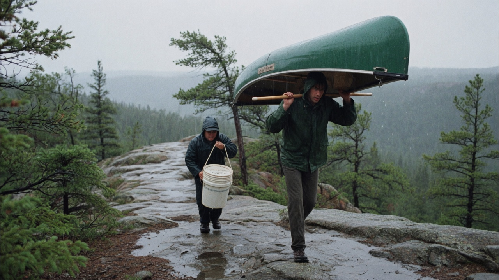

# Portage

[](https://github.com/lundgren-greg/portage-app/actions/workflows/ci.yml)
[](LICENSE)



**Portage** inventories files across the places they already live — internal disks, **external drives**, OneDrive, Google Drive, and later other providers — then moves them under a plan you confirm. The binary is `portage`. The GitHub repo is [`portage-app`](https://github.com/lundgren-greg/portage-app) so it does not collide with Gentoo Portage.

**Author / maintainer:** [Greg](https://github.com/lundgren-greg) (`@lundgren-greg`). Nothing lands on `main` except through a pull request he reviews.

When the same library is split across a full internal disk and two clouds — gaming clips, documents, archives, whatever you actually have — Portage builds one catalog, applies your placement rules, and sequences copy / shuttle / evict so local free space never goes below a reserved staging budget. It never deletes the last verified copy and never creates a public share. You can write the rules in YAML or **say them**; Grok compiles that into a dry-run plan. **The LLM never applies.** You type the plan id.

## Why this project

Explorer, rclone, and the official sync clients can copy bytes. They will also hydrate a cloud placeholder onto a disk with a few gigabytes free, overwrite a different file that happens to share a name, or leave a truncated object looking complete after a dropped connection. They have no notion of “this USB disk is only here so two clouds can pass a file,” or “keep a replica on the external drive *and* on whichever cloud still has quota.”

Portage is a **control plane** (catalog, policy, planner, journal) plus a **private data plane** (resumable upload/download with checksum verify). Cloud-to-cloud is always a local shuttle — often via an external disk when the internal volume is too small. Nothing is applied until you type the plan id.

## Use cases

The product is the same for any large library that has wandered. Gaming clips are a real one. They are not the only one.

| Situation | What you tell Portage |
| --- | --- |
| Game captures half on OneDrive, half on Google Drive, SSD almost full | Keep recent clips on the fast disk **and** on whichever cloud has more space. Older ones can leave the SSD once a verified cloud copy exists. |
| Work docs and PDFs in both clouds, copies you cannot tell apart | One inventory, confirmed duplicates by content, keep two verified copies where you asked — not three mystery ones. |
| A folder that should live on the USB drive *and* in the cloud | External disk is the **home**; the cloud is the replica. Or the reverse. |
| Internal disk has 4 GiB free and you need to move something large between clouds | Plug in the USB drive as a **hop**. Download → verify → upload → delete staging. The machine stays above its reserve. |
| Old zip/backup folders still sitting on C: or D: | Mark them archive / cloud-only. Evict local only after the remote copy verifies. |
| Same file under three names in three places | `dups` shows confirmed content matches. The plan does not delete the last verified copy. |

If it is a file on a disk or in a connected account, it is in scope. Portage does not become a game tool, a photo app, or a document suite — it places **bytes**.

**See everything in one place.** Index internal volumes, plugged-in external drives, Google Drive, and OneDrive (via their APIs — not desktop placeholders). Search, list by collection, and group confirmed duplicates by content hash.

**Say where a class of files should live.** Keep them on a chosen internal volume, on an external drive, in a specific cloud, on whichever connected cloud has more free space, or some combination (replica count, pin, cloud-only).

**Move bytes without filling the machine.** The planner prints residual free space after every step, including during a shuttle. Default reserve is 1 GiB. If the internal disk cannot hold the hop, Portage uses a connected external drive as staging instead of failing or writing the machine to zero bytes.

**Use an external drive as a hop *or* as home.** Same disk, two roles (you can enable both):

| Role | What it means |
| --- | --- |
| **Shuttle** | Intermediate transfer location. Download here from cloud A, verify, upload to cloud B, delete the staging file. The drive is not a replica just because bytes passed through it. |
| **Final** | Storage destination. Files may live here as a verified copy, alone or next to a cloud replica. |

The drive is identified by **volume serial**, not letter. If it is unplugged, any plan that needs it stops (`VolumeOffline`). An absent disk never authorizes deleting the last remaining copy.

**Confirm before anything mutates.** `portage plan` is a dry run. `portage apply` rejects `y` / `yes` / Enter. Undo is a reverse plan you confirm with a second id, and it refuses if that reverse would lose the last copy or breach the reserve.

**Say what goes where, and what to do first.** After the safety MVP, `portage ask` is a short conversation with an agent that is **on this PC or online** (Grok by default; Ollama / LM Studio if you want names to stay local). You state desire and priority — “free C: first, keep clips on D: and the cloud with more space, use the USB as the hop.” It asks until that is clear, then prints a plan. **It does not apply.** You type the plan id.

## Status

**Design approved. Implementation not started.** An agent should execute [docs/design.md](docs/design.md) beginning at **PR 1**. See [PROJECT.md](PROJECT.md), [docs/FEATURES.md](docs/FEATURES.md), and the [wiki](docs/wiki/README.md) ([GitHub Wiki tab](https://github.com/lundgren-greg/portage-app/wiki)).

## Key features (Release 1)

- Index local NTFS volumes (internal and removable) **and** Google Drive / OneDrive via their APIs.
- External / USB volumes as `shuttle`, `final`, or both.
- Content-addressed identity (BLAKE3). Provider checksums are bindings only.
- Capacity view per volume and per cloud, including the staging reserve.
- YAML collections and placement policies.
- Space-safe planner with residual free space after every step. User types the plan id to apply.
- Serial executor, crash journal, last-copy permit, private-only ACL assert, no silent overwrite.
- **No data loss is Release 1 P0.** Undo is a reverse plan you confirm with a second plan id.
- Clarify-then-plan agent (`portage ask`): desire + priority, local or online. Never applies.
- `portage-tui` (ratatui) after the safety MVP: color, hotkeys, plan review. Apply still types the plan id.

## Architecture

```text
portage-app/
  crates/
    portage-core/       # ids, hashing, paths, config
    portage-catalog/    # SQLite WAL
    portage-auth/       # OAuth PKCE + DPAPI/keyring
    portage-providers/  # local (incl. removable) + Drive + Graph
    portage-media/      # cheap header probe
    portage-engine/     # index, policy, planner, executor
    portage-cli/        # `portage` binary
    portage-sim/        # SimulatedWorld + property tests
    portage-tui/        # PR 15 — ratatui, after safety MVP
    portage-nl/         # PR 16 — Grok-first ask; never applies
  configs/examples/     # policy fixtures
  docs/design.md        # approved design + PR plan
  docs/FEATURES.md      # R1 P0 / safety MVP / TUI+NL / future releases
```

The workspace does not exist yet. PR 1 creates it. Until then CI skips Cargo steps.

## Requirements

- Windows 10/11 (primary). Linux/macOS must compile local+cloud paths.
- PowerShell 7+ (`pwsh`) for helper scripts.
- Rust stable (after PR 1).
- Bring-your-own OAuth client ids: `PORTAGE_GOOGLE_CLIENT_ID`, `PORTAGE_MS_CLIENT_ID`.
- Optional NL: `XAI_API_KEY` (Grok). Not required for CLI/TUI.

## Build and test

```powershell
# After PR 1 lands:
cargo test --workspace
cargo clippy --workspace -- -D warnings
cargo fmt --all -- --check
```

## Intended usage (after MVP)

```powershell
portage init
portage provider add local --root D:\ --id local-d
portage provider add local --root E:\ --id ext-media --role both
portage provider add google-drive
portage provider add onedrive
portage index
portage capacity
portage dups
portage plan
portage plan show
portage apply file-plan-7f3c   # type the plan id; y/yes is rejected
portage status
portage ask "keep these on the external drive and the cloud with more free space"
portage-tui                    # after PR 15
```

Empty, `y`, or `yes` is **rejected** at apply. Confirmation is the exact plan id. `portage ask` only prints a plan.

## Safety invariants

- Last verified copy is never deleted. An unplugged disk does not count.
- Every copy is checksum-verified before it counts as a replica.
- Local free space (internal *and* shuttle volume) never goes below `staging_reserve` (default 1 GiB) at any step.
- OneDrive / Google Drive for Desktop placeholders are not replicas and are never opened.
- Uploads are private. Inherited "anyone with the link" on a parent folder fails the op; a file we created is deleted.
- No telemetry. Tokens live in the OS credential store, never in YAML.

## Security and privacy

See [SECURITY.md](SECURITY.md). Cloud transfers are opt-in after `provider add`. There is no background daemon and no public-link feature.

## Contribution and development notes

- Read [PROJECT.md](PROJECT.md) first.
- Implement in the order in [docs/design.md](docs/design.md) **PR Plan**.
- Keep CI green.
- **`main` is PR-only.** Branch, open a pull request, wait for CI. [Greg](https://github.com/lundgren-greg) (`@lundgren-greg`) is the code owner and the only person who merges.

## Roadmap (high level)

| Item | Status |
|------|--------|
| Standard repo kit | Done |
| Approved design + feature set | Done — `docs/design.md` |
| PR 1 workspace + CLI stub | Next |
| Local index + dups, incl. removable volumes (PR 2–5) | Not started |
| Drive + OneDrive inventory (PR 6–8) | Not started |
| Planner dry-run (PR 9–10) | Not started |
| Confirmed apply + undo (PR 11–13) | Not started — P0 no-data-loss |
| Polish (PR 14) | Not started |
| TUI `portage-tui` (PR 15) | After safety MVP |
| NL `portage ask` / Grok (PR 16) | After planner; never applies |

## License

MIT. See [LICENSE](LICENSE). Copyright (c) 2026 Greg (`@lundgren-greg`).
