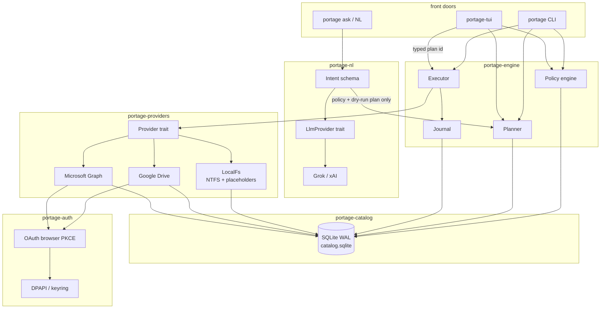

# Portage — Design Document

| Field | Value |
| --- | --- |
| **Title** | Portage: content-addressed inventory, placement policy, and space-safe shuttle for local + cloud files |
| **Author** | TBD |
| **Date** | 2026-08-14 |
| **Status** | Approved (review 2026-08-14, 3 rounds; user questions resolved 2026-08-14) |
| **Product name** | **Portage** |
| **CLI / binary** | `portage` |
| **GitHub repo** | `lundgren-greg/portage-app` |
| **License** | MIT |
| **Primary OS** | Windows 10/11 (NTFS). Linux and macOS must compile and run local+cloud paths; Windows-only APIs are isolated behind traits. |

### Name

**Keep the product name Portage.** The metaphor is exact: cargo is carried overland between two bodies of water because you cannot sail the gap. Here the “land” is a space-constrained local disk and the “waters” are cloud providers. Users already have the working name.

**Do not name the GitHub repository `portage`.** That name is owned in most engineers’ heads by Gentoo’s package manager. Use **`portage-app`**. The product and binary stay **Portage** / `portage`. Crate names are `portage-*`.

Rejected names: Ferry (too generic, collisions), Stow (too cute, unclear), Manifest (noun collision with container images), Ark (overused).

---

## Overview

Users have large personal libraries split across internal NTFS volumes, removable disks, Microsoft OneDrive, and Google Drive, with more providers coming. There is no unified inventory, no safe way to express “keep these files on this disk *and* on whichever cloud has more free space,” or “use the USB drive only as a hop,” and no tool that will actually move those bytes without (a) filling a disk that has only ~4 GiB free, (b) deleting the last copy, (c) corrupting a multi-gigabyte file on a dropped connection, or (d) accidentally creating an “anyone with the link” object.

Portage is a new standalone application (greenfield repo, not an extension of any existing scripts tree). It indexes every connected location into a local SQLite catalog using content-addressed identity, evaluates user placement policies, and produces an explicit, user-confirmed plan of copy / move / evict / shuttle operations. The planner is a space-aware sequencer: it will upload-and-evict to make room, then download, and it will refuse any plan that would drive local free space below a reserved staging budget at any step. The executor verifies checksums before it will consider a replica real, journals every mutation for crash resume, and never calls a public-sharing API.

The product front door in Release 1 is natural language (Grok first): the user says what they want, the model compiles that into collections/policy and a dry-run plan. **The LLM never applies.** Apply still requires typing the plan id. After the no-data-loss apply path works, a `ratatui` TUI (`portage-tui`) is the colorful review surface; the engine stays CLI-scriptable.

Release 1 is Windows-first. Linux/macOS must compile. Android and other OS clients are Future releases.

---

## Background & Motivation

### Current state

A typical library looks like this:

- Local SSD (e.g. `D:`) holds recent clips and is nearly full — **4 GiB free** is a realistic constraint, not a toy example.
- OneDrive holds another half of the library, some of it visible as Files On-Demand placeholders under `%USERPROFILE%\OneDrive`.
- Google Drive holds the rest, some of it visible via Drive for Desktop placeholders.
- The same clip may exist in two places under different names, or exist in only one place with no backup.
- Windows Explorer copy/move will hydrate placeholders, stall on multi-GB files, and will happily fill `D:` to 0 bytes.

### Pain points

1. **No inventory.** “Where are my clips, how big are they, and which ones are duplicates?” cannot be answered without opening three UIs and a spreadsheet.
2. **No capacity-aware planning.** A human cannot mentally sequence “upload 4.1 GiB to Google, delete local, then download 2.4 + 1.8 from Google and 2.0 from OneDrive” against a 4 GiB free budget and a staging reserve.
3. **Placeholder traps.** Hashing or copying a OneDrive online-only file hydrates it and can blow the disk.
4. **Unsafe tools.** rclone/rsync-class tools can do the transfers but will not enforce last-copy protection, private-only ACLs, or a confirmed plan with residual-space accounting.
5. **Cloud-to-cloud is a lie.** There is no first-party Google↔Microsoft byte pipe. Every cross-cloud move *is* a local shuttle and *does* cost local free space.

### Why a new app

This is a control-plane problem (catalog, policy, planner, journal) plus a data-plane problem (resumable private uploads/downloads with verify). Existing sync clients optimize for “make this folder the same,” not “satisfy replica policy without going negative on C:.”

---

## Goals & Non-Goals

### Goals

**Release 1 P0 — no data loss.** User files must be maintained. Last-copy protection, verify-before-delete, no apply without a typed plan id, no evict of a last *suspect* as if it were verified, and `undo` that refuses any reverse plan that would drop a blob to zero verified replicas or breach staging reserve are **not** optional polish. They ship before TUI and before the NL layer can compile to a plan.

Also in Release 1:

- Content-addressed inventory of local volumes and connected cloud providers, incremental, to at least **5 million file rows** and **multi-GB individual videos** without reading file bodies unless hashing or transferring.
- Capacity view per volume and per provider (used / free / quota).
- User-defined placement policies: collections, pin / keep-local / cloud-only, replica count, preferred provider, “most free cloud.” Engine default for Gaming Clips is `keep_local: prefer` + `replica_shortfall` warning unless the user (or NL compile) says the file **must** stay local → `required`.
- Dry-run plans the user must explicitly confirm. Residual local free space after every step. Rollback notes.
- Correct shuttle sequencing under a tight local free-space budget.
- Pluggable providers. Release 1: local NTFS (with placeholder awareness), Google Drive API, Microsoft Graph **personal** `/me/drive` only.
- Safety invariants listed in [Safety Model](#safety-model) are non-negotiable.
- Crash-safe journal; resume or compensate.
- OAuth: open browser → pick Google/Microsoft account → approve → return. Tokens encrypted at rest. No secrets in git. Bring-your-own client ids.
- CLI that covers the full loop: connect → index → search/dups/capacity → plan → show → confirm/apply → status/resume → undo.
- Natural-language front door (`portage ask`) that compiles utterances to policy + a dry-run plan. **LLM never applies.**
- `portage-tui` (ratatui) after the safety MVP (PR 15). Color, hotkeys, plan review. Apply from the TUI still requires typing the plan id.

### Non-Goals (Release 1)

- Real-time sync daemon / always-on watcher (USN journal / FUSE / Cloud Filter provider).
- Editing or transcoding media.
- Deduplicating *storage* (chunk-level CAS / CDC). We identify whole-file duplicates; we do not block-level-dedup on disk. “Remove duplicates” in NL means plan extra-*local* evicts of confirmed dups when another verified replica exists — never a last-copy delete, never a cloud delete in R1.
- Automatic destructive apply. No “just keep the disk optimized” background job. The LLM cannot bypass this.
- Becoming a backup product with versioning, retention, or ransomware timelines (we keep last-copy safe; we do not implement a backup catalog of historical versions).
- Microsoft 365 / SharePoint site drives (Release 2).
- Web UI or tray app.
- Encryption-at-rest of the user’s file contents (we are not a zero-knowledge vault).
- Bit-identical cloud-to-cloud without local staging. Not possible with Drive + Graph.
- Android / iOS / other-OS clients (Future releases).
- Running transfers or the catalog in a VM (idea only; Future releases).
- Creating or managing public share links — even as an opt-in feature in Release 1.
- Implementing `--allow-cloud-delete` (flag exists, rejected).
- Shipping a published OAuth client id (R1 is bring-your-own).

---

## Key Decisions

| # | Decision | Rationale |
| --- | --- | --- |
| K1 | **Language: Rust** (edition 2021, stable toolchain). Not Python, not C#. | The product *is* the safety invariants: last-copy, checksums, crash journal, never-negative free space. Rust lets us put those in types and refuse to compile a delete that was not authorized by a `VerifiedReplicaGuard`. Multi-GB streaming hash and serial IO are systems work. A single `portage.exe` on Windows is the right UX. Official Drive/Graph SDKs are a liability here — they expose share-link helpers we must never call. Thin REST wrappers over the 8–10 endpoints we actually use are smaller and auditable. Python would iterate OAuth faster and lose on the planner/journal. C# is excellent for Graph and DPAPI but weaker at encoding planner invariants and at producing a small cross-OS CLI. |
| K2 | **Repo `lundgren-greg/portage-app`, product/binary `portage`.** | Avoids Gentoo Portage and the niche “file-*” utility look. Keeps the metaphor. |
| K3 | **SQLite catalog, WAL mode.** Default `%LOCALAPPDATA%\Portage\catalog.sqlite`. If `C:` free < 8 GiB, `init` **recommends** the largest non-overlay volume (`D:\PortageData`). Engine rejects overlay / Cloud Filter / free < 8 GiB `data_dir`. | Single-user, local-first, zero-admin, transactional, handles millions of rows, easy backup (copy one file). Postgres would be theater. A catalog on a full C: or DriveFS mount is unsafe. |
| K4 | **Canonical content id is BLAKE3-256**, stored as `b3:<64 hex>`. Provider hashes (Google MD5, OneDrive SHA1 / QuickXor / SHA256) are *bindings*, not identity. On every transfer, hash BLAKE3 **and** the dest provider’s native algo in the same read; `UploadSession::finish` compares the computed native digest to the API-returned checksum. Evict STATs the dest and requires that stored native binding to match — never re-download a multi-GB object just to re-BLAKE3 it. | BLAKE3 is faster than SHA-256 on large videos and has a stable spec. Drive and Graph do not share a hash, so we cannot content-address cross-cloud without a local hash or a transfer. Index must not download cloud videos to obtain BLAKE3. Upload “verify” is native-digest match, not “BLAKE3 equals MD5.” |
| K5 | **Two-phase identity: `suspect` then `verified`.** Every listed byte-file gets its own proto-blob (`content_id` NULL) unless a `(provider, algo, hex, size)` binding already points at a blob. Name+size matches are a `portage dups` grouping only and **never** merge blobs or count as last-copy. | Confirmed/verified = same `ContentId` after a local hash or a transfer we dual-hashed. Planner last-copy counts only `replicas.state = verified`. |
| K6 | **Never read/hydrate cloud placeholders.** Sync roots are excluded from the local walker via concrete registry/volume detectors (OneDrive `UserFolder`, DriveFS `DefaultMountPoint` / `Share` / `SyncTargets`, always-exclude `%LOCALAPPDATA%\Google\DriveFS`). `provider add local` refuses a root that *is* an overlay or a DriveFS/Cloud Filter volume. Cloud truth is the provider API. | Opening an online-only OneDrive file or walking DriveFS `G:` for BLAKE3 would hydrate it and can fill the disk. This is a Sev-0 footgun. |
| K7 | **Cloud-to-cloud is always a local shuttle.** No third-party transfer SaaS. | Avoids giving a third party tokens and avoids public-link tricks some “transfer” tools use. |
| K8 | **Executor is strictly serial in v1.** Planner may reorder; executor never runs two space-consuming ops at once. | Parallel downloads make residual-space proofs false. Throughput is limited by one multi-GB video anyway. |
| K9 | **Temp + same-volume rename, then verify, then journal commit.** Local dest: BLAKE3 of tmp must match expected `ContentId` before rename. Cloud dest: native digest computed on the bytes we sent must match the provider’s returned checksum. Dest never appears under its final name (local) / is never treated as a replica (cloud) until that check passes. | Prevents a crash leaving a truncated file that looks complete. Windows `MoveFileEx` is atomic on the same volume. Native-digest match is the only way to verify an upload without re-downloading. |
| K10 | **Staging reserve is first-class budget. Default `staging_reserve_bytes = 1 GiB`. Floor is 64 MiB** (config below 64 MiB is rejected unless `flags.allow_tiny_reserve: true` / `--i-know`). Slack is a separate 64 MiB executor-only tolerance, not part of the reserve. Reserve is never allocatable to user payloads. | `max(1 GiB, 64 MiB)` is always 1 GiB and hid the floor. A move is not free of intermediate space. Users may lower reserve toward the floor to make a tight plan feasible; going below 64 MiB requires an explicit override. |
| K11 | **User confirmation gate is a typed plan id**, not “Y/n”. | Accidental enter on a 200-op plan is the failure mode we are designed against. |
| K12 | **OAuth tokens in OS credential store** (Windows DPAPI via `keyring` + `windows` CryptProtectData fallback). Refresh tokens never written as plaintext YAML. | Token theft = full library exfil. |
| K13 | **Provider trait forbids share-link methods.** `assert_private` walks the item **and its ancestors** (Drive `permissionDetails` / Graph `inheritedFrom`) and fails on Anyone / AnyoneWithLink / `link.scope == anonymous`. Parent ACL is checked **before** `begin_write`. On post-upload failure, if `we_created`, the executor deletes the item (journal `Compensating`) and does not leave a public object. | Inherited folder shares make a new private-looking upload public without calling `createLink`. Compensation delete is required; `we_created` is a journal column. |
| K14 | **MIT license.** | Personal tool, no patent posture, maximum reuse of the thin API clients. |
| K15 | **CLI-scriptable engine.** `portage-engine` is a crate. `portage` CLI and `portage-tui` are two binaries on the same crates. No business logic lives only in a UI. | Prevents CLI-shaped or TUI-shaped invariants. |
| K16 | **No silent overwrite.** Same dest path + different `ContentId` = conflict op, not a write. Same dest path + same `ContentId` = idempotent no-op. | Path is not identity. |
| K17 | **Release 1 providers implemented as HTTP + local FS, not rclone embedding.** | rclone is AGPL and its surface includes public-link and server-side copy behaviors we do not want to inherit. |
| K18 | **Clarify-then-plan agent, local or online.** `portage-nl` talks to an `LlmProvider`. The user states **desire** (what goes where) and **priority** (what to free or keep first). The agent asks until `Intent` is unambiguous, then the deterministic planner emits a dry-run. Online default: xAI Grok (`XAI_API_KEY`, `https://api.x.ai/v1`, `grok-4.5` — re-check docs.x.ai). Local: any OpenAI-compatible endpoint (Ollama, LM Studio, etc.). Same trait. | The fun product is conversation + a seatbelt, not a hidden janitor. Paths stay on-box if the user picks local. |
| K19 | **LLM never applies.** It emits structured `Intent` → policy YAML fragment + a dry-run `PlanId`. Apply, evict, upload, delete stay behind the typed plan-id gate (and last-copy / private-only / reserve). The model has no `Executor` handle. | An LLM that can delete is how you lose the library. |
| K20 | **No data loss is Release 1 P0.** Safety MVP (PRs 1–13 apply+undo) ships before TUI and before NL compile-to-plan. | User: files must be maintained. Fun UX is R1 but after apply is safe. |
| K21 | **TUI after safety MVP.** `portage-tui` (ratatui) is PR 15. Color, hotkeys, configurability. It reviews plans and can *launch* apply; the user still types the plan id. PRs 1–13 are not blocked on it. | Fun surface without putting chrome in front of last-copy. |
| K22 | **Catalog location: `init` recommends; NL may confirm; engine rejects unsafe dirs.** If `C:` free < 8 GiB, recommend the largest non-overlay volume (`D:\PortageData`). No silent move. Reject `data_dir` on a volume with free < 8 GiB or that is an overlay / Cloud Filter mount. | Catalog on a full C: or a DriveFS mount is a Sev-0 footgun. |
| K23 | **Undo is reverse-plan + second typed plan id.** Never auto-start re-downloads. Refuse if the reverse plan would drop any blob to zero verified replicas or breach staging reserve. | Undo that silently re-downloads can fill the disk; undo that deletes a last copy is data loss. |
| K24 | **Removable volumes are first-class locations.** An external / USB drive can be a **final** dest, a **shuttle** hop (staging when the internal disk cannot hold a transfer), or both. Identity is **volume serial**, not drive letter. Unplugged → fail closed (`VolumeOffline`); do not invent a last copy on a missing disk. | Internal SSDs are often the 4 GiB bottleneck. The portage *is* often an external disk. |

---

## Proposed Design

### High-level architecture



Responsibilities:

| Component | Responsibility | Must not do |
| --- | --- | --- |
| **CLI** | Parse, render tables, confirmation prompt, progress bars | Mutate files except by calling executor |
| **TUI** | Color inventory/plan review, hotkeys, launch apply | Apply without a typed plan id; own a second executor |
| **NL (`portage-nl`)** | Utterance → validated `Intent` → policy fragment + dry-run plan | Call executor; delete; evict; upload; skip confirm |
| **Catalog** | Durable inventory, plans, journal, capacity snapshots | Know about HTTP |
| **Indexer** | Walk / page providers, upsert rows, schedule hashes | Open placeholders; load whole videos |
| **Policy engine** | Pure function: catalog + rules → desired placement per **file** (then attached to that file’s blob) | Touch the network |
| **Planner** | Desired − current → ordered ops with residual **during and after** each op | Apply anything |
| **Journal** | Crash-safe state machine per op | Decide policy |
| **Executor** | Serial apply, verify, last-copy check, ACL assert | Skip verify; call share APIs |
| **Providers** | List / stat / ranged read / delete / quota / ACL | Hydrate; create public links |
| **Auth** | Browser PKCE (open → pick account → approve → return), refresh, token encrypt | Log tokens |

### Process model

One process, one catalog lock (`%data_dir%/portage.lock`). `portage init` (PR 1) creates the empty lock file and data dir. `portage-catalog` (PR 3) owns the lock implementation (`fs2` / `std::fs::File` exclusive vs shared). A second invocation that needs the catalog (`index`, `plan`, `apply`, `resume`) exits with `catalog locked by pid N`. Read-only commands (`capacity` cached, `plan show`, `search`, `list`) take a shared lock.

No daemon in v1. Incremental index is on-demand.

### Workspace and module tree

New repo `portage-app` (nothing in `C:\Repos\Scripts` is part of this product):

```text
portage-app/
├── Cargo.toml                          # workspace
├── Cargo.lock
├── rust-toolchain.toml                 # stable
├── LICENSE                             # MIT
├── README.md
├── SECURITY.md                         # token handling, no public shares
├── CONTRIBUTING.md
├── .gitignore
├── .github/
│   └── workflows/
│       ├── ci.yml                      # windows-latest + ubuntu-latest: fmt, clippy -D, test
│       └── release.yml                 # cargo build --release, upload portage.exe
├── configs/
│   └── examples/
│       └── gaming-clips.yaml           # checked-in example, no secrets
├── docs/
│   ├── design.md                       # this document, copied into the repo in PR 1
│   └── threat-model.md
├── migrations/
│   ├── 0001_init.sql                   # providers, files, blobs, replicas, checksums, scans
│   └── 0002_plans_journal.sql          # plans, plan_ops (during+after residual), journal (we_created)
└── crates/
    ├── portage-core/
    │   ├── Cargo.toml
    │   └── src/
    │       ├── lib.rs
    │       ├── ids.rs                  # ContentId, BlobId, ProviderId, PlanId, OpId
    │       ├── hash.rs                 # BLAKE3, QuickHash, MultiHasher (native algos)
    │       ├── error.rs                # thiserror
    │       ├── units.rs                # ByteSize, FreeSpace
    │       ├── paths.rs                # rooted path, traversal checks
    │       └── config.rs               # typed config + YAML
    ├── portage-catalog/
    │   ├── Cargo.toml
    │   └── src/
    │       ├── lib.rs
    │       ├── db.rs                   # open, PRAGMAs, migrate
    │       ├── files.rs
    │       ├── blobs.rs
    │       ├── replicas.rs
    │       ├── scans.rs
    │       ├── capacity.rs
    │       ├── plans.rs
    │       └── journal.rs
    ├── portage-auth/
    │   ├── Cargo.toml
    │   └── src/
    │       ├── lib.rs
    │       ├── oauth.rs                # oauth2 crate, loopback redirect
    │       ├── store.rs                # keyring + DPAPI
    │       └── scopes.rs
    ├── portage-providers/
    │   ├── Cargo.toml
    │   └── src/
    │       ├── lib.rs
    │       ├── traits.rs               # Provider, UploadSession
    │       ├── registry.rs
    │       ├── local/
    │       │   ├── mod.rs
    │       │   ├── walk.rs
    │       │   ├── placeholder.rs      # FILE_ATTRIBUTE_RECALL_*, reparse tags
    │       │   ├── sync_roots.rs       # OneDrive/GDrive desktop roots
    │       │   └── volume.rs           # GetDiskFreeSpaceEx
    │       ├── gdrive/
    │       │   ├── mod.rs
    │       │   ├── list.rs
    │       │   ├── transfer.rs         # resumable upload / download
    │       │   └── acl.rs
    │       ├── onedrive/
    │       │   ├── mod.rs
    │       │   ├── list.rs             # Graph delta
    │       │   ├── transfer.rs         # upload session, 320 KiB multiples
    │       │   └── acl.rs
    │       └── mock.rs                 # in-memory provider for tests
    ├── portage-media/
    │   ├── Cargo.toml
    │   └── src/
    │       ├── lib.rs
    │       └── mp4.rs                  # ftyp/moov duration+resolution, first 1 MiB only
    ├── portage-engine/
    │   ├── Cargo.toml
    │   └── src/
    │       ├── lib.rs
    │       ├── index.rs
    │       ├── policy.rs
    │       ├── planner.rs
    │       ├── space.rs                # residual simulation
    │       ├── executor.rs
    │       ├── last_copy.rs
    │       └── undo.rs
    ├── portage-cli/
    │   ├── Cargo.toml                  # [[bin]] name = "portage"
    │   └── src/
    │       ├── main.rs
    │       ├── cmd/
    │       │   ├── mod.rs
    │       │   ├── init.rs
    │       │   ├── provider.rs
    │       │   ├── index.rs
    │       │   ├── search.rs
    │       │   ├── list.rs                 # portage list --collection
    │       │   ├── dups.rs
    │       │   ├── capacity.rs
    │       │   ├── plan.rs
    │       │   ├── apply.rs
    │       │   ├── status.rs
    │       │   ├── resume.rs
    │       │   ├── undo.rs
    │       │   ├── doctor.rs
    │       │   └── ask.rs              # portage ask — NL front door (PR 16)
    │       └── render.rs               # tables, plan listing
    ├── portage-sim/
    │   ├── Cargo.toml
    │   └── src/
    │       ├── lib.rs                  # SimulatedWorld for property tests
    │       └── bin/
    │           └── portage-sim.rs
    ├── portage-nl/                       # PR 16; optional read-only stub after PR 5
    │   ├── Cargo.toml
    │   └── src/
    │       ├── lib.rs
    │       ├── intent.rs               # Intent JSON schema
    │       ├── compile.rs              # Intent → policy + planner input
    │       └── providers/
    │           ├── mod.rs              # trait LlmProvider
    │           └── grok.rs             # xAI
    └── portage-tui/                      # PR 15, after safety MVP
        ├── Cargo.toml                  # [[bin]] name = "portage-tui"
        └── src/
            └── main.rs
```

Workspace members at PR 1 are the original **eight** crates (`portage-core`, `portage-catalog`, `portage-auth`, `portage-providers`, `portage-media`, `portage-engine`, `portage-cli`, `portage-sim`). `portage-tui` joins in PR 15. `portage-nl` joins in PR 16 (a compile-only stub crate may land earlier if it does not call the planner). Shared deps pinned in `[workspace.dependencies]`: `tokio`, `rusqlite`, `serde`, `serde_yaml`, `blake3`, `md-5`, `sha1`, `sha2`, `reqwest`, `oauth2`, `keyring`, `tracing`, `thiserror`, `anyhow`, `clap`, `indicatif`, `uuid`, `time`, `walkdir`, `proptest`, `tempfile`, `directories`, `infer`, `base64`, `url`, `async-trait`, `fs2`, `ratatui`, `crossterm`, `windows` (Windows target only).

### Content identity

```rust
// crates/portage-core/src/ids.rs
#[derive(Clone, Copy, Eq, PartialEq, Hash, Ord, PartialOrd)]
pub struct ContentId([u8; 32]); // BLAKE3-256

impl ContentId {
    pub fn to_string(&self) -> String; // "b3:" + hex
    pub fn parse(s: &str) -> Result<Self>;
}

/// Cheap prefilter. Not identity.
pub struct QuickHash {
    pub size: u64,
    pub head: [u8; 64], // first 64 KiB compressed to 64 bytes via BLAKE3 keyed, or first 64 bytes + last 64 of first 64 KiB
    pub head_len: u32,
}

/// Digests produced in a single read of a source or staging file.
pub struct TransferDigests {
    pub content_id: ContentId,                 // BLAKE3
    pub native: Vec<(HashAlgo, String)>,       // dest provider algos hashed in the same pass
}

pub enum HashAlgo { Blake3, Md5, Sha1, Sha256, QuickXor }
```

`hash.rs` exposes `MultiHasher`: one 1 MiB buffer, update BLAKE3 plus whichever native algos `Provider::native_hashes()` requested. Never `read_to_end`. QuickXorHash is implemented per Microsoft’s spec (`hash.rs` + a documented test vector); it is not “XOR the file.” If Graph omits a hash family, we compute and persist only the ones the finish payload actually returns — match requires **at least one** advertised native algo to be present and equal; zero advertised hashes after upload is `Error::NativeHashMissing` (do not evict).

Hashing and blob-creation rules (implement this exact write path — PR 5/7/9/10 must not invent another):

1. **Every listed byte-file gets a `files` row** (`kind = 'byte'`). Directories are `kind = 'directory'`. Google shortcuts / OneDrive `.url` pointers are `kind = 'shortcut'` with `shortcut_target_ref` set; they are **not** replicas and never get a blob.
2. **Proto-blob:** on insert of a byte-file, create a `blobs` row with `content_id NULL` and `size = file.size`, and a `replicas` row with `state = 'suspect'`, **unless** a `provider_checksums` row already exists for `(provider_id, algo, hex, size)` with a non-null `blob_id` — then attach this file to that blob (still `suspect` until a `ContentId` exists).
3. **LocalFull hash:** when the indexer hashes a dirty local file, set `blobs.content_id` and flip that replica to `verified`. Skip body hash when `ntfs_file_id + size + mtime` unchanged and `content_id` is already set.
4. **Cloud objects are not downloaded to obtain BLAKE3 during index.** Persist `provider_checksums` from the list/delta payload only.
5. **Binding on transfer:** while reading the local source (upload) or staging file (shuttle/download), run `MultiHasher` for BLAKE3 + dest-native algos. `UploadSession::finish` compares `TransferDigests.native` to the API-returned `md5Checksum` / `file.hashes`. On match, persist both, set `content_id` if null, mark the dest replica `verified`. On mismatch: abort, do not evict, delete dest if `we_created`.
6. **Evict verify:** STAT dest and require the stored native binding to still match the provider’s current checksum + size. Do **not** re-download to re-BLAKE3.
7. **Name+size “suspect groups”** are a SQL query used only by `portage dups` (normalized basename + size). They do **not** merge blobs, do **not** write `provider_checksums`, and do **not** participate in last-copy.
8. **Collection match runs on the file** (path, mime, extension), then `collections_cache` stores `(file_id, collection)`. If two files later collapse onto one blob via a checksum binding, the planner takes the **union** of their collections and the more conservative placement (`Required` beats `Prefer` beats `CloudOnly`; higher `min_replicas` wins).

**Hash collision:** 2^-256 is treated as impossible. Defense in depth: a `ContentId` match with a **different size** is a hard abort (`Error::Invariant("content id collision")`) and stops the plan. We do not “pick one.” Same for a native-binding match with a different size.

### Incremental index

Local:

- Persist `(volume_serial, ntfs_file_id, size, mtime_utc, attrs, hydration, last_seen_scan)`.
- Skip body hash when `ntfs_file_id + size + mtime` unchanged and we already have a `ContentId`.
- NTFS file reference number from `GetFileInformationByHandle` (not the path) is the stable local identity across renames inside a volume.
- v1 walker is `jwalk`/`walkdir` with a 1000-row transaction batch. USN Journal is v1.1.

Cloud:

- Google: `changes.list` with `startPageToken`; full `files.list` on first connect.
  - Query: `'me' in owners and trashed = false` (v1 does **not** inventory shared-with-me).
  - Fields: `id,name,mimeType,size,md5Checksum,modifiedTime,parents,trashed,shortcutDetails,owners,permissions(id,type,role,permissionDetails)`.
- OneDrive: Graph `delta` on `/me/drive/root/delta`. Skip items with `remoteItem` (files shared from another drive). Personal `/me/drive` only.
- Persist delta cursor per provider in `scan_cursors`. Each run inserts a `scans` row; `files.last_scan_id` references it.

**Sync-root exclusion (K6) — concrete detectors for PR 4:**

`portage-providers/src/local/sync_roots.rs` enumerates overlay roots and writes `overlay_roots`. `LocalFs` does **not** walk those trees except to record “this path is an overlay, do not hydrate.” The cloud providers own those objects.

**OneDrive (Files On-Demand / Cloud Filter):**

1. Registry: for each subkey of `HKCU\Software\Microsoft\OneDrive\Accounts\*`, read `UserFolder` (absolute path). Register each as `overlay_roots` with `provider_id` matching the configured `onedrive` provider if present, else `overlay:onedrive`.
2. Per-file: `FILE_ATTRIBUTE_RECALL_ON_DATA_ACCESS` (0x00400000), `FILE_ATTRIBUTE_RECALL_ON_OPEN` (0x00040000), or reparse tag in `IO_REPARSE_TAG_CLOUD` … `IO_REPARSE_TAG_CLOUD_F` → `hydration = placeholder`. Any non-`LocalFull` hydration is **not** a replica.

**Google Drive for Desktop (DriveFS) — do not hand-wave this:**

DriveFS commonly mounts a virtual drive (often `G:`) via `DefaultMountPoint`. Streamed files are **not** reliable OneDrive-style placeholders; walking that volume is the Sev-0 hydrate footgun.

1. Registry (read all that exist):
   - `HKCU\Software\Google\DriveFS\DefaultMountPoint` (e.g. `G:`)
   - `HKCU\Software\Google\DriveFS\Share` (per-share mount paths if present)
   - `HKCU\Software\Google\DriveFS\*\SyncTargets` and per-profile `HKCU\Software\Google\DriveFS\<profile>\*` values whose data are absolute paths
2. Always treat `%LOCALAPPDATA%\Google\DriveFS` as an overlay/cache root and exclude it from **every** local walk (including `C:\` and `D:\`).
3. Volume probe: if `GetVolumeInformation` name contains `Google Drive` / `DriveFS`, or the filesystem/device path is a DriveFS or Cloud Filter mount, the **entire volume** is an overlay.

**`portage provider add local --root` must refuse overlays:**

- Canonicalize the root (`GetFinalPathNameByHandle`).
- If the root **is** an overlay path, **is contained in** one, or sits on a DriveFS / Cloud Filter volume → **reject** with `Error::OverlayRoot` and tell the user to `provider add google-drive` / `onedrive` instead. Example: `portage provider add local --root G:\` is refused when `G:` is `DefaultMountPoint`.
- If a configured local root *contains* an overlay (typical: `--root C:\` contains `%USERPROFILE%\OneDrive`), auto-register the inner overlay and skip it during the walk — do not refuse the whole `C:\`.
- `portage doctor` **fails** on Windows if OneDrive is installed (`HKCU\Software\Microsoft\OneDrive`) or DriveFS is installed (`HKCU\Software\Google\DriveFS`) and zero `overlay_roots` were registered. Also fails if a configured local root is itself an overlay.

### Capacity model

```rust
pub struct Capacity {
    pub location: LocationId,
    pub total_bytes: Option<u64>, // None if unknown (some SMB)
    pub used_bytes: u64,
    pub free_bytes: u64,          // authoritative for planning
    pub quota_bytes: Option<u64>,
    pub measured_at: time::OffsetDateTime,
}

pub struct SpaceBudget {
    pub volume: LocationId,
    pub free: u64,
    pub reserved_staging: u64,    // never allocated to user payloads
    pub reserved_in_flight: u64,  // executor-held
}

impl SpaceBudget {
    pub fn usable(&self) -> u64 {
        self.free.saturating_sub(self.reserved_staging + self.reserved_in_flight)
    }
}
```

Sources:

| Location | API |
| --- | --- |
| Local volume | `GetDiskFreeSpaceExW` on the volume root (not a folder estimate) |
| Google Drive | `GET /drive/v3/about?fields=storageQuota` |
| OneDrive | `GET /me/drive?select=quota` (`remaining`, `total`, `used`) |

Every plan step writes **two** residual maps per affected location into `plan_ops`: `residual_during_json` (trough while the op holds dest/staging bytes) and `residual_after_json` (after tmp rename or staging delete). `plans.min_residual` is `min(trough)` over all ops on that volume — the during-op invariant, not the after-op value. The apply prompt prints that trough.

`slack_bytes` (default 64 MiB) is executor-only and is **not** subtracted in the planner `sim`. It is **not** the SpaceDrift gate by itself.

**Executor preflight before starting op N** (both predicates; fail either → `Error::SpaceDrift`, do not start the op). Define `residual_after[0][vol]` as the capacity snapshot the planner used (start-of-plan free). `bytes_held_during_N` is `size` for `download` / `shuttle` / `ingest`, else `0`.

```text
live = GetDiskFreeSpaceExW(vol)          # just before op N
prev = residual_after[N-1][vol]          # sim free at this point; N=1 → plan-time free

# (1) drift vs the sim at the *start* of this op (not vs the planned trough)
if live + slack < prev:
    pause SpaceDrift { reason: start_free_below_sim, live, expected: prev }

# (2) this op’s trough would still honor the reserve
if live - bytes_held_during_N < staging_reserve:
    pause SpaceDrift { reason: trough_would_breach_reserve, live, held: bytes_held_during_N }
```

Do **not** use `live < residual_during - slack` as the only gate. `residual_during` is already `start − size` for downloads/shuttles, so that comparison only fires after live has already fallen to the *end* of the op — too late to protect the reserve. Worked counter-example: after L2 evict, sim free is 7.50; Windows Update consumes 1.50 (live = 6.00). G1 (2.20) has `residual_during = 5.30`. The old gate `6.00 < 5.30 − 0.06` is false and would start the download; after G1+O1+G2 live would be **0.00**, below the 1.00 GiB reserve. Predicate (1) `6.00 + 0.06 >= 7.50` is false → pause. Phase 4 still asserts the *plan* troughs ≥ reserve; that does not replace this live check.

**Staging dir** must live on a configured local volume. Default pick order: (1) a connected volume whose role includes `shuttle` with the most free space, (2) otherwise the non-overlay volume with the most free space. Temp files for a dest on volume X **must** be created on volume X so rename is atomic. Cross-volume “rename” is a copy and is forbidden for finalize.

### Removable / external volumes

External HDDs, USB SSDs, and other removable NTFS volumes are the same `local` provider with extra metadata. They are **not** a later provider type.

```yaml
providers:
  - id: ext-media
    type: local
    root: "E:\\"                    # current mount; identity is volume serial
    removable: true
    roles: [shuttle, final]         # shuttle | final | both
```

| Role | Meaning |
| --- | --- |
| `final` | Eligible as `prefer_local` / `required` dest. Files may live here as a verified replica. |
| `shuttle` | Eligible as the local hop for cloud-to-cloud and as `staging_dir` when internal usable space is too small. After the upload verifies, staging on this volume is deleted. |
| both | Default for a user-added external disk. |

Rules:

1. **Identity = volume serial** (`GetVolumeInformation` serial). Drive letter changes (`E:` → `F:`) update `locations.root`; they do not create a second location.
2. **Offline is fail-closed.** If a plan op’s src, dest, or staging volume is not mounted, `plan` / `apply` / `resume` stop with `Error::VolumeOffline` and the volume’s label/serial. Do not skip the op. Do not count an unplugged disk as a verified replica that can authorize a last-copy delete.
3. **Shuttle on external does not make it a replica.** Bytes sitting in `.portage-staging` on `E:` are journal `Partial`, not `verified`.
4. **Safe removal.** While any journal op is `Transferring` / `Verifying` on that serial, `doctor` and `status` say do not eject. Sudden unplug → resume rules (rehash tmp or restart); never evict a last copy because staging vanished.
5. **Refuse overlays.** Same K6 checks. A DriveFS virtual letter is not an external disk.
6. **Capacity.** `GetDiskFreeSpaceExW` on the volume root. Shuttle plans must keep *that* volume’s trough ≥ `staging_reserve` too.

`portage provider add local --root E:\ --id ext-media --role both` records serial + roles. `portage capacity` shows internal vs removable separately.

Worked case: internal `D:` has 4 GiB free (usable 3 GiB). File X is 8 GiB on Google, policy wants it on OneDrive only. `E:` (2 TiB USB, role `shuttle`) is mounted. Planner shuttles X via `E:\.portage-staging`, not via `D:`. If `E:` is unplugged, the plan is `Unsatisfiable` with “plug in ext-media (serial …) or free 8 GiB on D:”.

### Placement policies

Policy evaluation is a pure function of the **file** (path, mime, extension), not of the blob:

```text
eval(config.collections, file, capacities) -> DesiredPlacement
```

First matching collection wins (document order). Unmatched files get `collections.default`. The result is stored on `collections_cache(file_id, collection)` and read by the planner via the file’s blob (see identity rule 8 for merge).

```rust
pub enum KeepLocal { Required, Prefer, CloudOnly }
pub enum CloudChoice {
    MostFree { among: Vec<ProviderId> },
    Specific(ProviderId),
    Any(Vec<ProviderId>),
}

pub struct DesiredPlacement {
    pub keep_local: KeepLocal,
    pub local_targets: Vec<LocationId>, // e.g. D: SSD preferred over C:
    pub min_verified_replicas: u32,     // includes local if present; always >= 1
    pub cloud: CloudChoice,
    pub pin_local: bool,                // never evict even if Prefer and space is tight
    pub dest_subdir: Option<String>,    // see dest-path rule below
}
```

`Prefer` means: place locally if the planner can do so without violating staging reserve after all required evictions; otherwise drop local from the goal and emit a plan warning (`local_preferred_unmet`), not a hard fail. `Required` + insufficient space after evictions = unsatisfiable plan.

**`prefer` fallback vs `min_replicas`:** `most_free` and `specific` each select **one** cloud dest. If prefer then drops local, the remaining goal may have only one location. That is **not** Unsatisfiable. Effective replica target becomes `max(1, |goal_locations|)` and the plan records warning `replica_shortfall` (`wanted=2, placed=1, reason=prefer_dropped_local`). `Required` that cannot place local *and* cannot reach `min_replicas` without that local copy **is** Unsatisfiable. `CloudOnly` + `min_replicas >` number of distinct allowed clouds is Unsatisfiable at compile (Phase 0).

**Dest-path construction** (deterministic; used by planner and executor):

```text
if dest already holds this file (same remote_ref / same location+path): keep that path
else:
  dest_path = join(dest_subdir or "", basename(file.path))
  # dest_subdir is relative to the provider root (Drive My Drive / OneDrive root / volume root)
  # We do NOT preserve the local parent chain (D:\Videos\Captures\x.mp4 → Gaming/Clips/x.mp4)
```

`preserve_relpath` is not in v1. Same dest path + different identity → conflict op (`needs_manual`), never overwrite. Same dest path + same `ContentId` or same native binding → idempotent no-op.

### Planner algorithm (space-constrained shuttle)

This is the core of the product. It is deterministic. It does not apply anything.

#### Inputs

- Catalog snapshot: **files** (byte-files only), their blobs (including proto-blobs with `content_id` NULL), replicas, placeholders (ignored as replicas), capacities.
- `DesiredPlacement` per file (see policy eval), collapsed per blob via rule 8.
- `staging_reserve_bytes` (config; default 1 GiB, floor 64 MiB).
- `slack_bytes` (default 64 MiB) — not consumed in simulation; executor-only.

Placeholders, `kind != byte`, and `Partial` journal rows are **not** replicas. `suspect` replicas are sources of last resort for *copy* (we may download them) but **never** count toward last-copy or `ready_evict`.

#### Phase 0 — Compile goals

Iterate every `files` row with `kind = 'byte'` and `hydration != placeholder` (local hashed, local unhashed, **and** cloud-unhashed proto-blobs). Policy already ran on the file.

1. Compute `goal_locations: BTreeSet<LocationId>` from `DesiredPlacement`.
2. Enforce at least one remaining location (last-copy is not optional).
3. If `keep_local == CloudOnly` and the only current replica is local, goal **must** include a cloud dest before any evict is generated.
4. Unhashed cloud files are first-class: they already have a proto-blob + suspect replica. Do **not** require `IngestAndHash` just to apply policy. `IngestAndHash` is emitted only when the planner must obtain a `ContentId` before an evict (it never should: evict requires a verified dest, which a transfer already dual-hashes). If a file is larger than `usable + evictable` and the goal needs it locally, mark that file `Unsatisfiable`.

#### Phase 1 — Diff to unordered actions

```text
NeedPlace(blob, dest)     if dest ∈ goal and no Verified replica at dest
                          (a suspect replica at dest does not satisfy the goal)
CanEvict(blob, loc)       if loc ∉ goal and loc is local and pin_local == false
                          AND (other *verified* replicas already exist
                               OR a NeedPlace to a cloud is also generated)
`--allow-cloud-delete` is parsed by the CLI in MVP and rejected with
  "not implemented in v0.1; cloud objects are never deleted" (exit 2).
  Evict means local only. Planner never emits cloud deletes.
```

Source selection for `NeedPlace`:

1. Prefer a **local full** replica whose hydration is `LocalFull` (upload, zero extra local space). Verified preferred over suspect; a local Full file we hashed is verified.
2. Else any cloud replica of this blob (verified or, for the only copy, the suspect proto-blob’s file). If dest is the other cloud → `Shuttle`.
3. Else fail `NoSource`.

#### Phase 2 — Classify

| Class | After-op local Δ | During-op trough | `residual_during` | `residual_after` |
| --- | ---: | ---: | --- | --- |
| `UploadKeep` | 0 | 0 | = after | free |
| `UploadThenEvict` (two `plan_ops` rows: upload, then evict) | +size after evict | 0 during upload | = after for upload; after for evict | evict: free+size |
| `EvictOnly` | +size | 0 | = after | free+size |
| `Download` | −size | −size (tmp **is** the dest file) | = after | free−size |
| `Shuttle` (one `plan_ops` row, kind=`shuttle`) | 0 after staging delete | **−size** while staging exists | **free−size** | free (restored) |
| `IngestAndHash` | 0 or −size | −size | trough | after |

Atomic write needs **one** times `size` on the dest volume, not two: we write `dest.portage-tmp-{opid}` and rename onto `dest` only after verify. We never hold tmp and final simultaneously.

`plans.min_residual` and the apply prompt use **min(residual_during)** across ops, not min(residual_after). A shuttle that returns free to 7.50 GiB but troughs at 5.10 GiB reports min residual 5.10 GiB for that step.

#### Phase 3 — Sequence (greedy; **not complete**)

Maintain `sim: HashMap<LocationId, u64>` free bytes, initialized from capacity.

This search is deterministic and space-safe on every prefix it emits. It is **not** a complete solver: `Unsatisfiable` means *this* priority search failed, not that no permutation exists. Do not claim completeness.

```text
loop:
  if pending is empty: SUCCESS

  ready_upload_evict = Uploads whose src is local, dest.free >= size,
                       and blob has a pending CanEvict
  ready_evict        = Evicts whose blob already has *verified* replica
                       count >= max(1, effective_min_replicas) in the
                       simulated post-state (including uploads already
                       sequenced). Suspect dests do not count.
  ready_upload_keep  = Uploads with src local, dest.free >= size
  ready_shuttle      = Shuttles with local.usable - size >= 0
                       and dest.free >= size
                       # net-zero local *after*; trough is −size
  ready_download     = Downloads with dest.usable - size >= 0

  pick first non-empty in this priority:
    1. ready_upload_evict, largest size first   # make room
    2. ready_evict, largest first
    3. ready_upload_keep, largest first         # bind native checksums early
    4. ready_shuttle, *best fit*                # net-zero after; do NOT
                                                # let permanent downloads
                                                # starve a feasible shuttle
    5. ready_download, *best fit*

  best fit = largest size that still fits usable (deterministic; ties
             broken by blob_id ascending, then dest location id).

  if picked:
      trough = sim[local] - (size if class in {Download, Shuttle, IngestAndHash} else 0)
      assert trough >= staging_reserve
      apply after-delta to sim
      record PlanOp {
        residual_during: { loc: trough or sim },
        residual_after:  { loc: sim },
        rollback_note
      }
      mark dest replica verified in sim (upload/download/shuttle)
      if Evict: remove local replica in sim
      continue

  # stuck — this search failed
  return Unsatisfiable {
      leftover,
      min_shortfall,
      suggestions: [
        "mark X CloudOnly",
        "lower staging_reserve (floor 64 MiB; --i-know below that)",
        "free Y which is unreferenced by policy",
        "add a provider with more quota",
        "try moving a download after a shuttle (greedy may have failed)",
      ]
  }
```

**Why shuttles outrank downloads:** shuttle is net-zero local space after staging delete; download permanently consumes local space. Counter-example on this document’s budget (4.00 GiB free, 1.00 GiB reserve, usable 3.00): download A=2.50 then shuttle B=2.00 sticks (usable 0.50); shuttle B first (during free 2.00 ≥ reserve) then download A succeeds (final free 1.50). Priority 4 before 5 finds that plan. See fixed scenario “2.50-download + 2.00-shuttle.”

**Invariants checked after every simulated step (and in property tests):**

- `residual_during[local] >= staging_reserve` and `residual_after[local] >= staging_reserve` for every local volume (the trough is the 4 GiB invariant).
- Verified replica count for every blob that had a `verified` replica is `>= 1` after every op. Suspect-only proto-blobs may be copied; they may not be the source of an evict.
- No op overwrites a dest path whose existing content id (or native binding) differs.
- No op reads a placeholder.

If Phase 3 succeeds, run Phase 4: **re-simulate from scratch** as a pure checker (independent implementation in `space.rs`) and assert identical `residual_during` / `residual_after` maps. The checker must assert `trough >= staging_reserve` on every local volume. This catches planner bugs before a user sees the plan.

#### Worked example — 4 GiB free

Assumptions:

- Volume `D:` 104 GiB total, **4.00 GiB free**, 100.00 GiB used.
- `staging_reserve = 1.00 GiB` → starting `usable = 3.00 GiB`.
- Google Drive free = 15.00 GiB.
- OneDrive free = 40.00 GiB → **most-free cloud is OneDrive**.
- Other local data (not in play) = 89.60 GiB.

This inventory is what the checked-in `configs/examples/gaming-clips.yaml` actually produces (Archives first; Gaming Clips = video and not Archive/Archives/OldClips). Paths are part of the fixture. `path_contains` is a literal substring: `/Archive/` does not match `/Archives/`.

| File / proto-blob | Size | Path | Current | Matching collection → policy |
| --- | ---: | --- | --- | --- |
| L1 | 5.50 GiB | `D:\Videos\Captures\boss.mp4` | Local D: verified | Gaming Clips → prefer local + most-free (OneDrive) |
| L2 | 3.50 GiB | `D:\OldClips\old.mp4` | Local D: verified | **Archives** → cloud-only Google |
| L3 | 0.80 GiB | `D:\Videos\Captures\tiny.mp4` | Local D: verified | Gaming Clips → prefer local + most-free |
| G1 | 2.20 GiB | gdrive `…/g1.mp4` (video) | Google (suspect until first transfer; still a NeedPlace to local) | Gaming Clips |
| G2 | 1.80 GiB | gdrive `…/g2.mp4` | Google suspect | Gaming Clips |
| O1 | 2.00 GiB | onedrive `…/o1.mp4` | OneDrive suspect | Gaming Clips |
| G3 | 7.00 GiB | `gdrive:/Archives/cutscene.mp4` | Google, already on the Archives dest | **Archives** (`/Archives/` is an explicit `path_contains` token; `/Archive/` alone does **not** match) → cloud-only Google, already satisfied. **Zero ops.** |

Desired new local bytes = G1+G2+O1 = 6.00 GiB. Evictable = L2 = 3.50 GiB. Start free 4.00, after evict 7.50, after downloads 7.50−6.00 = 1.50 ≥ 1.00 reserve. **Feasible.**

Unsatisfiable if we also required O2 = 1.00 GiB local: final free would be 0.50 < 1.00 reserve.

**Produced plan (serial).** Download pick is **best fit = largest that still fits usable**. After L2 evict, usable = 6.50; the three downloads all fit, so order is G1 (2.20) → O1 (2.00) → G2 (1.80). Residuals **5.30 → 3.30 → 1.50**. PR 10’s fixture must use these numbers — not G1→G2→O1.

| Step | Op | Size | Src | Dest | D: during | D: after | Rollback note |
| ---: | --- | ---: | --- | --- | ---: | ---: | --- |
| 1 | Upload L2 | 3.50 | `D:\OldClips\old.mp4` | `gdrive:/Archives/old.mp4` | 4.00 | 4.00 | If `we_created`: delete gdrive item on native-hash or ACL fail |
| 2 | Evict L2 | 3.50 | `D:\OldClips\old.mp4` | — | **7.50** | **7.50** | Re-download from stored gdrive `remote_ref` (native binding must still STAT-match) |
| 3 | UploadKeep L1 | 5.50 | `D:\Videos\Captures\boss.mp4` | `onedrive:/Gaming/Clips/boss.mp4` | 7.50 | 7.50 | Delete OD item if `we_created` and verify/ACL fail |
| 4 | UploadKeep L3 | 0.80 | `D:\Videos\Captures\tiny.mp4` | `onedrive:/Gaming/Clips/tiny.mp4` | 7.50 | 7.50 | same |
| 5 | Download G1 | 2.20 | gdrive | `D:\Videos\Captures\g1.mp4` | **5.30** | **5.30** | Delete local tmp/final |
| 6 | Download O1 | 2.00 | onedrive | `D:\Videos\Captures\o1.mp4` | **3.30** | **3.30** | Delete local tmp/final |
| 7 | Download G2 | 1.80 | gdrive | `D:\Videos\Captures\g2.mp4` | **1.50** | **1.50** | Delete local tmp/final |

`plans.min_residual` for D: = **1.50 GiB**. Upload L2 is dual-hashed: BLAKE3 of the local source (already known) + MD5 of the same bytes, compared to Drive `md5Checksum` before step 2 is legal.

**G3 generates zero ops.** Under the checked-in YAML, `gdrive:/Archives/cutscene.mp4` matches collection Archives (`/Archives/` + first-match), policy is cloud-only Google, and the file is already a Google replica. The YAML-loaded PR 10 fixture must assert `ops_for(G3) == []`. If `/Archives/` is omitted from `path_contains`, G3 falls through to Gaming Clips → prefer-local fails (7.00 > usable 6.50) → 7 GiB Google→OneDrive shuttle → also larger than usable 6.50 → the whole plan is Unsatisfiable. That is a fixture bug, not a planner miss.

Illegal alternative (planner must not emit): download G1 first. `usable` is 3.00, so 2.20 fits, residual 1.80, usable 0.80 — G2/O1 no longer fit until L2 is evicted. Priority 1–2 force L2 upload+evict **before** any download.

**Shuttle sub-example.** File X = 2.40 GiB lives only on Google, policy says OneDrive only (cloud-only Archives switch, or a one-off dest):

1. After L2 evict, D: free = 7.50, usable = 6.50.
2. Single `kind=shuttle` op: download X to `D:\.portage-staging\op-{id}.part`.
   - `residual_during` D: = **5.10 GiB**
   - `residual_after` D: = **7.50 GiB** (staging deleted)
   - `plans.min_residual` accounts for **5.10**, not 7.50
3. `MultiHasher` on the staging bytes: BLAKE3 + OneDrive native (SHA1 / QuickXor / SHA256 as advertised).
4. Resumable upload; `finish` compares computed native digest to `file.hashes`. Persist both; mark dest verified.
5. Pre-checked parent ACL; `assert_private` on the new item **and ancestors**. On fail: if `we_created`, delete item, journal `Compensating`.
6. Delete staging (after residual 7.50).
7. Do **not** delete the Google original. `--allow-cloud-delete` is rejected in MVP.

During the shuttle, local free stays ≥ reserve. Phase 4 asserts `trough 5.10 >= 1.00`.

```mermaid
sequenceDiagram
  actor User
  participant CLI
  participant Planner
  participant Exec
  participant Journal
  participant Local
  participant GDrive
  participant OneDrive

  User->>CLI: portage plan
  CLI->>Planner: compile + sequence
  Planner-->>CLI: plan_id, ops, residuals
  User->>CLI: portage apply <plan_id>
  CLI->>User: type plan id to confirm
  User->>CLI: file-plan-0x…
  loop each op serial
    Exec->>Journal: ReservedSpace
    Exec->>Local: preflight (1) live+slack>=residual_after[N-1] (2) live-held>=reserve; SpaceDrift pauses
    alt Upload
      Exec->>GDrive: GET parent permissions (inherited); refuse if public
      Exec->>Local: MultiHasher BLAKE3 + MD5 while reading source
      Exec->>GDrive: resumable put
      GDrive-->>Exec: item + md5Checksum
      Exec->>Exec: native MD5 match (not BLAKE3==MD5); persist both
      Exec->>GDrive: GET item+ancestors; assert_private
      Exec->>Exec: on ACL fail: delete if we_created; Compensating
    else Download
      Exec->>Local: write .portage-tmp
      Exec->>Local: BLAKE3 verify, rename
    else Evict
      Exec->>GDrive: STAT dest; native binding must still match
      Exec->>Exec: LastCopyGuard (verified only)
      Exec->>Local: delete only if guard ok
    end
    Exec->>Journal: Committed
  end
```

### Executor and journal

Journal is table `journal_ops` (same SQLite, WAL + `PRAGMA synchronous=FULL` on the connection that writes journal transitions). Each transition `fsync`s via a committed SQL transaction.

```text
NotStarted
  → ReservedSpace          # budget.reserved_in_flight += size if dest local or shuttle
  → ParentAclChecked       # uploads/shuttles: dest parent+ancestors private, else abort
  → Transferring           # HTTP session url / local tmp path stored; we_created=1 once dest exists
  → Verifying              # local: BLAKE3; cloud: native digest vs API
  → Verified
  → AssertedPrivate        # uploads only; item + ancestors
  → DeletingSource         # only if op is move/evict and LastCopyGuard
  → SourceDeleted
  → ReleasedSpace
  → Committed
  → Compensating → RolledBack
       # Compensating is required if Verifying or AssertedPrivate fails
       # and we_created=1: delete the dest item we created (do not leave
       # a public or corrupt object). Then RolledBack.
  → NeedsAttention         # human required; never auto-delete
```

Resume (`portage resume`):

- `Transferring` with a stored byte offset: continue ranged upload/download.
- `Verifying` : local dest — rehash BLAKE3; if match, continue; if not, delete dest tmp and restart transfer. Cloud dest — STAT and compare stored native binding to the API checksum; if mismatch, if `we_created` delete dest and restart; never treat as verified.
- `AssertedPrivate` fail or crash: if `we_created`, delete dest (item + confirm gone), then `RolledBack`. If delete fails, `NeedsAttention` (possible public object — `doctor` flags it).
- `DeletingSource` : re-check last-copy; STAT dest native binding; if dest still verified, finish delete; if dest missing, **stop** (`NeedsAttention`) — do not delete.
- `ReservedSpace` with no dest bytes: release and retry.

**Last-copy guard** (executor, not just planner):

```rust
pub struct LastCopyGuard<'a> { /* txn */ }
impl LastCopyGuard<'_> {
    /// Counts replicas with state=verified in catalog+journal, excluding
    /// the source we are about to delete, Placeholders, and suspects.
    /// For a cloud dest, STAT and require the stored native binding to
    /// match before counting it.
    pub fn authorize_delete(&self, blob: BlobId, source: ReplicaId) -> Result<Permit>;
}
```

`Permit` is consumed by `Provider::delete`. There is no public delete that takes only a path.

### Provider interface

```rust
// crates/portage-providers/src/traits.rs
use async_trait::async_trait;
use portage_core::{HashAlgo, TransferDigests};

#[async_trait]
pub trait Provider: Send + Sync {
    fn id(&self) -> &ProviderId;
    fn kind(&self) -> ProviderKind; // Local, GoogleDrive, OneDrive, ...

    async fn capacity(&self) -> Result<Capacity>;

    /// Must not hydrate placeholders. Local impl skips overlay roots.
    async fn list_page(&self, cursor: Option<ScanCursor>) -> Result<ListPage>;

    async fn stat(&self, loc: &RemoteRef) -> Result<ObjectMeta>;

    /// Local placeholders → Error::WouldHydrate (never open).
    async fn open_read(
        &self,
        loc: &RemoteRef,
        range: Option<ByteRange>,
    ) -> Result<Box<dyn futures::AsyncRead + Send + Unpin>>;

    async fn begin_write(&self, spec: &WriteSpec) -> Result<Box<dyn UploadSession>>;

    async fn delete(&self, loc: &RemoteRef, permit: last_copy::Permit) -> Result<()>;

    async fn mkdir_p(&self, path: &ProviderPath) -> Result<RemoteRef>;

    /// Item ACL plus inherited / permissionDetails / inheritedFrom.
    async fn acl(&self, loc: &RemoteRef) -> Result<Acl>;

    /// Walk loc and every ancestor. Fail if any entry is Anyone,
    /// AnyoneWithLink, or Graph `link.scope == anonymous`.
    async fn assert_private(&self, loc: &RemoteRef) -> Result<()>;

    /// Same walk on the dest *parent* before begin_write. Refuse upload
    /// into an already-public folder.
    async fn assert_parent_private(&self, parent: &RemoteRef) -> Result<()>;

    fn native_hashes(&self) -> &'static [HashAlgo];
}

#[async_trait]
pub trait UploadSession: Send {
    fn dest(&self) -> &WriteSpec;
    async fn write_chunk(&mut self, offset: u64, bytes: &[u8]) -> Result<()>;
    /// Compare `expected.native` to the provider-returned checksums.
    /// Do not compare BLAKE3 to MD5/SHA1. On match return RemoteRef;
    /// caller persists both digests. On mismatch return Error::NativeHashMismatch.
    async fn finish(self: Box<Self>, expected: &TransferDigests) -> Result<RemoteRef>;
    async fn abort(self: Box<Self>) -> Result<()>;
}

pub struct ObjectMeta {
    pub remote: RemoteRef,
    pub path: ProviderPath,
    pub size: Option<u64>,
    pub mtime: Option<time::OffsetDateTime>,
    pub mime: Option<String>,
    pub hydration: Hydration, // LocalFull | Placeholder | CloudNative
    pub provider_hashes: Vec<(HashAlgo, String)>,
    pub is_shortcut_or_link: bool, // skip Google shortcuts as content
}

pub struct AclEntry {
    pub principal: Principal, // User, Group, Anyone, AnyoneWithLink
    pub role: AclRole,
    pub inherited: bool,
    pub inherited_from: Option<RemoteRef>,
}

pub struct Acl {
    pub entries: Vec<AclEntry>,
}

pub enum ProviderKind { Local, GoogleDrive, OneDrive, Dropbox, S3, Smb }
```

**There is no `create_link`, `share`, or `set_anyone` on the trait.** Provider modules must not include those endpoints even as dead code. CI `rg` check in `portage-providers`:

```text
createLink|anyoneWithLink|type['\"]:\s*['\"]anyone|permissions\.create
```

must match only test fixtures that assert we *reject* such payloads.

#### Local provider specifics (Windows)

- Walk with `FILE_FLAG_OPEN_REPARSE_POINT` semantics: **do not follow** directory junctions/symlinks that escape the configured root (`paths.rs` canonicalize + prefix check).
- Treat as placeholder if any of:
  - `FILE_ATTRIBUTE_RECALL_ON_DATA_ACCESS` (0x00400000)
  - `FILE_ATTRIBUTE_RECALL_ON_OPEN` (0x00040000)
  - reparse tag in `IO_REPARSE_TAG_CLOUD` … `IO_REPARSE_TAG_CLOUD_F`
- `GetDiskFreeSpaceExW` per volume serial.
- Overlay roots skipped (K6). `provider add local` refuses DriveFS/Cloud Filter volumes and roots that *are* overlays; `C:\` containing OneDrive is allowed with the inner tree skipped. `%LOCALAPPDATA%\Google\DriveFS` is always excluded.
- `WriteSpec` for local: create `dest.portage-tmp-{opid}` with `CREATE_NEW`, write, `FlushFileBuffers`, hash, `MoveFileEx(MOVEFILE_WRITE_THROUGH)` only if dest absent or dest hash matches.

#### Google Drive v1

- Installed-app OAuth, loopback **`http://127.0.0.1:<ephemeral>/`** (register that exact scheme+host in Google Cloud Console; not `localhost`). Scopes:
  - `https://www.googleapis.com/auth/drive` — required to inventory existing user files *and* upload into user folders. `drive.file` cannot see the user’s existing clips.
  - We still never call the permissions-create-anyone API.
- List/delta query **must** include `'me' in owners and trashed = false`. Shared-with-me is out of v1.
- Resumable upload (`uploadType=resumable`), 8 MiB chunks (multiple of 256 KiB).
- Partial download via `Range`.
- Ignore `application/vnd.google-apps.*` (Docs/Sheets) — not byte files.
- `shortcutDetails` present → `files.kind = 'shortcut'`, `shortcut_target_ref = targetId`. No blob, no replica.
- Before `begin_write`: `assert_parent_private` on dest parent (uses `permissionDetails` so inherited `anyone` is visible).
- After upload: `GET files/{id}?fields=md5Checksum,parents,permissions(id,type,role,permissionDetails)` and `assert_private` (item + walk parents until My Drive root). Native verify: computed MD5 vs `md5Checksum`.
- `assert_private` failure + `we_created` → `delete` the item, journal `Compensating`.

#### OneDrive / Graph v1

- Scopes: `Files.ReadWrite`, `User.Read`, `offline_access`. Personal `/me/drive` only in v1 (no SharePoint site drives).
- OAuth redirect **must** be `http://localhost` (any port). Azure public-client docs do not treat `http://127.0.0.1` as equivalent; PR 6 registers `http://localhost` for the Microsoft app and `http://127.0.0.1` for Google.
- Upload session; fragments multiple of **320 KiB**; 10,240 KiB (10 MiB) default fragment.
- Delta on `/me/drive/root/delta`. Skip `remoteItem` (shared-from-another-drive).
- Before `begin_write`: `assert_parent_private` (Graph `permissions` + `inheritedFrom` on the dest folder).
- After upload: `GET /me/drive/items/{id}?expand=permissions` and walk `parentReference` until drive root. Fail if `link.scope == anonymous` or principal `anyone`. `we_created` + fail → delete item.
- Native verify: `MultiHasher` SHA1 / QuickXor / SHA256 (whichever `file.hashes` will return) vs the upload response. Bindings only — not `ContentId`.

#### Future-release providers (interfaces only in Release 1)

Dropbox, S3-compatible (Backblaze B2, Wasabi, AWS), SMB/NAS, Microsoft 365 / SharePoint. Same trait. S3: private ACL `bucket-owner-full-control` / block public ACLs; never `public-read`. See [Future releases](#future-releases).

### Indexer + media

- MIME via `infer` on the first 8 KiB of **LocalFull** files only.
- Duration/resolution: parse MP4 `moov` if those 8 KiB (or a follow-up read of at most 1 MiB) contain it. Optional `ffprobe` if `PORTAGE_FFPROBE` is set — never a hard dep.
- Multi-GB MKV without a cheap header: leave duration null. Do not scan the whole file for metadata.

### UX (CLI)

| Command | Behavior |
| --- | --- |
| `portage init` | Measure `C:` free. If `C:` < 8 GiB, **recommend** (do not silently use) the largest non-overlay volume as `data_dir` (e.g. `D:\PortageData`). Show the recommendation and wait for accept / `--data-dir`. Reject a chosen dir on a volume with free < 8 GiB or that is an overlay / Cloud Filter mount. Then write config, empty catalog, lock file. |
| `portage provider add google-drive` | Open the system browser → user picks the Google account → approve → return to the CLI. Store token; write provider id into config. Consent copy must say why full `drive` is required (`drive.file` cannot see existing clips). |
| `portage provider add onedrive` | Same browser PKCE flow for Microsoft personal account (`/me/drive` only). |
| `portage provider add local --root D:\ --id local-d` | Register a fixed volume (`roles: [final]` default) |
| `portage provider add local --root E:\ --id ext-media --role both` | Register a removable volume as shuttle hop and/or final dest. Stores volume serial. |
| `portage provider list` | Ids, kind, account, last index, capacity |
| `portage index [--provider ID]` | Incremental scan + local hash of dirty LocalFull files |
| `portage search QUERY` | Path / collection / mime substring, SQL LIKE + optional FTS later |
| `portage list --collection "Gaming Clips"` | Table: size, path, providers, hydration, content id |
| `portage dups` | Confirmed groups and suspect groups, separate sections |
| `portage capacity` | Per location used/free/quota + staging reserve + projected |
| `portage plan [--collection …]` | Build plan, store, print summary + path to full listing |
| `portage plan show [PLAN]` | Full op list with residuals |
| `portage apply PLAN [--allow-cloud-delete] [--i-know]` | Prompt: type the plan id; then serial execute. `--allow-cloud-delete` is **parsed and rejected** in MVP (`not implemented in v0.1; cloud objects are never deleted`, exit 2). `--i-know` is required together with `flags.allow_tiny_reserve` to accept `staging_reserve_bytes < 64 MiB` at plan/apply time. |
| `portage status` | In-flight journal, last plan, lock holder |
| `portage resume` | Continue Needs-resume journal |
| `portage undo` | Build a **reverse plan** of the last committed plan. Never auto-start re-downloads. Print the reverse plan and require a **second typed plan id**. Refuse (exit 6 or 4) if any reverse op would drop a blob to zero verified replicas or if the reverse plan’s trough would breach `staging_reserve`. |
| `portage doctor` | Lock, catalog integrity, overlay roots, token validity, placeholder sanity, `rg`-equivalent ACL audit of last uploads |
| `portage ask "…"` | NL front door (PR 16). Compiles the utterance to an `Intent`, writes/shows a policy fragment, runs the planner, prints a dry-run plan. **Does not apply.** |
| `portage-tui` | Separate binary (PR 15). Browse inventory, review a plan in color, hotkeys to expand ops, launch apply (still types the plan id). |

`apply` confirmation text:

```text
Plan file-plan-7f3c will run 7 operations, move 15.80 GiB,
minimum residual on D: is 1.50 GiB (trough, reserve 1.00 GiB).
Type the plan id to apply, or Ctrl-C to abort:
>
```

Empty, `y`, or `yes` is **rejected**.

Exit codes: `0` ok, `2` usage, `3` locked, `4` unsatisfiable plan, `5` space drift, `6` last-copy, `7` ACL/public, `8` verify fail, `10` needs attention.

### Natural-language agent (clarify → plan)

The fun product: you say **what should go where** and **what to prioritize**. An agent — **on this machine or online** — asks until that is unambiguous, then the existing planner prints a dry-run. You still type the plan id.

The LLM is the front door, not an executor. Crate: `portage-nl`. CLI: `portage ask`. TUI uses the same loop. **There is no `apply` method on this crate.**

#### Loop

```text
desire + priority  →  agent may ask 1–3 questions  →  Intent JSON
        →  compile.rs (deterministic)  →  planner dry-run  →  you type the plan id
```

- **Desire** = placement: keep recent clips on D:, archives on the USB, replica on the cloud with more space.
- **Priority** = order when space is tight: free C: first, never touch pinned, evict unpinned archives before anything else.
- If `Intent` is missing a dest, a volume, or a priority when the disk is tight, the agent **asks**. It does not guess a delete.
- Online providers receive a **redacted catalog digest** (counts, sizes, volume labels, collection names — not full path lists) unless the user opts into `nl.send_paths: true`. Local providers may read the full digest on-box.

#### Provider trait (local or online)

```rust
#[async_trait]
pub trait LlmProvider: Send + Sync {
    fn id(&self) -> &str;
    fn residency(&self) -> Residency; // Local | Online
    async fn complete_json(&self, system: &str, user: &str, schema: &JsonSchema) -> Result<serde_json::Value>;
}
```

| Provider | When | Config |
| --- | --- | --- |
| **Online / Grok** (default in R1) | You want the better clarifier | `nl.provider: grok`, `XAI_API_KEY`, `https://api.x.ai/v1`, model `grok-4.5` (re-check docs.x.ai) |
| **Local** | Paths and names never leave the PC | `nl.provider: local`, `nl.local.base_url` (Ollama / LM Studio / any OpenAI-compatible `localhost`), `nl.local.model` |
| Later | Other online vendors | More `LlmProvider` impls (`openai`, `anthropic`, …) |

R1 ships **Grok** and a **local OpenAI-compatible client**. Same `Intent` schema. Switching providers does not change last-copy or confirm.

#### Intent schema (compiler input)

The model must return JSON that deserializes to `Intent`. On schema failure, `portage ask` reprints the error and does not touch policy. If the model returns `needs_clarification`, the CLI/TUI asks those questions and calls the model again (cap 3 rounds).

```rust
pub struct Intent {
    pub summary: String,                    // restatement the user can reject
    pub goal: Goal,                         // Place | MakeSpace | Consolidate | Mix
    pub collections: Vec<CollectionDraft>,  // may be empty → existing YAML
    pub keep_local: Option<KeepLocal>,      // None → engine default prefer
    pub dests: Vec<DestHint>,               // local path and/or provider+subdir
    pub priorities: Vec<Priority>,          // order when space is tight
    pub year: Option<i32>,
    pub dedup: DedupIntent,                 // None | ExtraLocalOnly
    pub data_dir: Option<PathBuf>,
    pub needs_clarification: Vec<String>,   // empty ⇒ ready to compile
}

pub enum Goal { Place, MakeSpace, Consolidate, Mix }
pub enum Priority {
    FreeVolume { location: String },      // "free C:"
    KeepPinned,
    EvictUnpinnedArchivesFirst,
    PreferNewestLocal { collection: String },
    UseShuttle { location: String },      // "use the USB as the hop"
}
pub enum DedupIntent { None, ExtraLocalOnly }
pub struct DestHint {
    pub kind: DestKind, // LocalPath | ProviderSubdir
    pub location: String,
}
```

Compile rules (`compile.rs`), deterministic, no LLM:

1. If `needs_clarification` is non-empty, do not compile — ask.
2. Validate `Intent` against the catalog (unknown provider → error; overlay `data_dir` → engine reject).
3. If `data_dir` is set, same reject rules as `init` (free < 8 GiB or overlay → refuse).
4. Merge `CollectionDraft` into a policy fragment. Do not silently replace the user’s YAML; write a dated fragment under `%data_dir%/intents/` and show the diff.
5. Apply `priorities` as planner hints: evict order, which volume to free, whether a shuttle volume is in play. They cannot override last-copy, pin, or `required`.
6. `keep_local`: `Required` only if the user named a must-keep dest. Otherwise **`prefer`** + `replica_shortfall`.
7. `DedupIntent::ExtraLocalOnly`: evict extra **local** replicas of a confirmed blob only when another **verified** replica remains. Never emit cloud deletes.
8. Call the existing planner. Show the dry-run. Stop.
9. The user runs `portage apply <plan-id>` (or the TUI typed-confirm modal).

#### Example utterances

**Gaming clips (default policy):**

> “Keep my gaming videos on D: if they fit, and on whichever of Google Drive or OneDrive has more free space.”

Compiles to the checked-in Gaming Clips collection (`keep_local: prefer`, `cloud: most_free`). Tight disk → `replica_shortfall`, still Satisfiable.

> “My gaming clips must stay on C:.”

Compiles to `keep_local: required` on that collection. Unsatisfiable if they do not fit after evictions.

**Photo consolidation (user example):**

> “Please remove all my duplicate photos across all locations and consolidate my photos onto my C drive photos directory and my google drive photos for this year.”

Compiles to:

| Field | Value |
| --- | --- |
| Collection | Photos — `mime_prefix: image/`, optional `mtime` year = current year |
| `keep_local` | `required` (they named a C: directory) |
| Local dest | `C:\Users\<user>\Pictures` or an explicit `C:\…\Photos` if it exists; else ask |
| Cloud dest | `gdrive:/Photos/<year>` |
| Dedup | `ExtraLocalOnly` — extra local copies of a confirmed blob, only if a verified replica remains |
| Cloud deletes | none (R1) |
| Apply | not invoked |

If C: cannot hold the required local photos after evicting extra dups, the planner returns Unsatisfiable with suggestions — still no writes.

#### What the NL layer must never do

- Hold an `Executor`, call `apply`, `delete`, `evict`, or `begin_write`.
- Skip `LastCopyGuard`, `assert_private`, or the typed plan-id prompt.
- Invent a public share or a cloud-to-cloud SaaS path.
- Choose a `data_dir` the engine would reject.

#### When to implement

- **Read-only stub** (optional, after PR 5): `portage ask` can answer “what photos do I have?” by compiling to `search` / `dups` / `list` only. No planner. Safe because it cannot mutate.
- **Compile-to-plan: PR 16**, depends on PR 10 (planner) and preferably PR 12 (so a produced plan is apply-able). Not before.

### TUI (`portage-tui`)

Second binary, ratatui + crossterm. Color, hotkeys, user-configurable theme/keybinds (config `tui:`). Screens: capacity, collections, dups, plan review (expand/collapse ops, residual column highlighted when close to reserve), doctor. **Apply key** opens the same typed-plan-id modal as the CLI. The TUI does not get a hidden confirm. Engine remains fully usable with no TUI installed.

---

## API / Interface Changes

Greenfield — no existing public API. The crate surface above *is* the API.

Config path resolution (Windows first):

1. `PORTAGE_CONFIG` if set
2. `%LOCALAPPDATA%\Portage\config.yaml`
3. Linux/macOS: `$XDG_CONFIG_HOME/portage/config.yaml` or `~/.config/portage/config.yaml`

Catalog and logs live next to config under the same data dir (`directories::ProjectDirs` with qualifier `dev`, organization `lundgren-greg`, application `Portage`).

---

## Data Model Changes

SQLite, WAL, `foreign_keys=ON`, `busy_timeout=5000`. Migrations in `migrations/*.sql` applied by `refinery` or `rusqlite_migration` at open.

```sql
-- migrations/0001_init.sql (excerpt; full file in PR 3)

PRAGMA journal_mode = WAL;

CREATE TABLE providers (
  id            TEXT PRIMARY KEY,          -- "gdrive", "local-d"
  kind          TEXT NOT NULL,             -- local|google_drive|onedrive
  account       TEXT,
  config_json   TEXT NOT NULL DEFAULT '{}',
  created_at    TEXT NOT NULL
);

CREATE TABLE locations (
  id            TEXT PRIMARY KEY,          -- volume serial or provider id
  provider_id   TEXT NOT NULL REFERENCES providers(id),
  kind          TEXT NOT NULL,             -- volume|cloud
  label         TEXT,
  root          TEXT,
  UNIQUE(provider_id, root)
);

CREATE TABLE overlay_roots (
  path          TEXT PRIMARY KEY,
  provider_id   TEXT NOT NULL,             -- may be "overlay:onedrive" before cloud provider is added
  detector      TEXT NOT NULL              -- onedrive_userfolder|drivefs_mount|drivefs_cache|cloud_filter_volume
);

CREATE TABLE scans (
  id            INTEGER PRIMARY KEY,
  provider_id   TEXT NOT NULL REFERENCES providers(id),
  started_at    TEXT NOT NULL,
  finished_at   TEXT,
  files_seen    INTEGER NOT NULL DEFAULT 0,
  status        TEXT NOT NULL              -- running|ok|error
);

CREATE TABLE files (
  id            INTEGER PRIMARY KEY,
  location_id   TEXT NOT NULL REFERENCES locations(id),
  parent_id     INTEGER REFERENCES files(id),
  path          TEXT NOT NULL,             -- provider-relative, no '..'
  name          TEXT NOT NULL,
  kind          TEXT NOT NULL DEFAULT 'byte', -- byte|directory|shortcut
  shortcut_target_ref TEXT,                -- set iff kind='shortcut'; not a replica
  is_dir        INTEGER NOT NULL DEFAULT 0,
  size          INTEGER,
  mtime_utc     TEXT,
  ntfs_file_id  TEXT,                      -- local only
  volume_serial TEXT,
  mime          TEXT,
  hydration     TEXT NOT NULL,             -- local_full|placeholder|cloud_native
  remote_ref    TEXT,                      -- provider item id
  last_scan_id  INTEGER REFERENCES scans(id),
  UNIQUE(location_id, path)
);

CREATE INDEX files_remote ON files(location_id, remote_ref);
CREATE INDEX files_name ON files(name);

CREATE TABLE blobs (
  id            INTEGER PRIMARY KEY,
  content_id    TEXT UNIQUE,               -- b3:hex, nullable until hashed
  size          INTEGER NOT NULL,
  mime          TEXT,
  duration_ms   INTEGER,
  width         INTEGER,
  height        INTEGER
);

CREATE TABLE replicas (
  id            INTEGER PRIMARY KEY,
  blob_id       INTEGER NOT NULL REFERENCES blobs(id),
  file_id       INTEGER NOT NULL REFERENCES files(id),
  state         TEXT NOT NULL,             -- verified|suspect|partial
  UNIQUE(file_id)
);

CREATE INDEX replicas_blob ON replicas(blob_id, state);

CREATE TABLE provider_checksums (
  provider_id   TEXT NOT NULL REFERENCES providers(id),
  remote_ref    TEXT NOT NULL,
  algo          TEXT NOT NULL,             -- md5|sha1|sha256|quickxor
  hex           TEXT NOT NULL,
  size          INTEGER NOT NULL,
  blob_id       INTEGER REFERENCES blobs(id),
  PRIMARY KEY (provider_id, remote_ref, algo)
);

CREATE INDEX provider_checksums_lookup ON provider_checksums(algo, hex, size);

CREATE TABLE scan_cursors (
  provider_id   TEXT PRIMARY KEY REFERENCES providers(id),
  cursor        TEXT,
  full_scan_at  TEXT,
  last_scan_at  TEXT
);

CREATE TABLE capacity_snapshots (
  id            INTEGER PRIMARY KEY,
  location_id   TEXT NOT NULL REFERENCES locations(id),
  total_bytes   INTEGER,
  used_bytes    INTEGER NOT NULL,
  free_bytes    INTEGER NOT NULL,
  quota_bytes   INTEGER,
  measured_at   TEXT NOT NULL
);

CREATE TABLE collections_cache (
  file_id       INTEGER NOT NULL REFERENCES files(id),
  collection    TEXT NOT NULL,
  PRIMARY KEY (file_id, collection)
);

-- Name+size grouping for `portage dups` only. Not last-copy. Not a merge.
-- Implemented as a query, not a table:
--   SELECT size, lower(name), group_concat(id) FROM files
--   WHERE kind='byte' GROUP BY size, lower(name) HAVING count(*) > 1;
```

```sql
-- migrations/0002_plans_journal.sql

CREATE TABLE plans (
  id              TEXT PRIMARY KEY,        -- "file-plan-" + 8 hex
  created_at      TEXT NOT NULL,
  status          TEXT NOT NULL,           -- drafted|confirmed|running|committed|aborted|unsatisfiable
  summary_json    TEXT NOT NULL,
  min_residual    INTEGER NOT NULL,        -- min trough (residual_during) over ops
  staging_reserve INTEGER NOT NULL
);

CREATE TABLE plan_ops (
  plan_id              TEXT NOT NULL REFERENCES plans(id),
  seq                  INTEGER NOT NULL,
  op_id                TEXT NOT NULL UNIQUE,
  kind                 TEXT NOT NULL,      -- upload_keep|upload_evict|evict|download|shuttle|ingest
  blob_id              INTEGER REFERENCES blobs(id),
  file_id              INTEGER REFERENCES files(id),
  size                 INTEGER NOT NULL,
  src_json             TEXT NOT NULL,
  dest_json            TEXT NOT NULL,
  residual_during_json TEXT NOT NULL,      -- {location_id: free_bytes} trough
  residual_after_json  TEXT NOT NULL,      -- {location_id: free_bytes} after op
  rollback_note        TEXT NOT NULL,
  PRIMARY KEY (plan_id, seq)
);

CREATE TABLE journal_ops (
  op_id           TEXT PRIMARY KEY,
  plan_id         TEXT NOT NULL REFERENCES plans(id),
  state           TEXT NOT NULL,
  offset          INTEGER NOT NULL DEFAULT 0,
  tmp_path        TEXT,
  session_uri     TEXT,
  we_created      INTEGER NOT NULL DEFAULT 0, -- 1 once dest object/tmp exists
  dest_remote_ref TEXT,                       -- set when cloud dest is created
  error           TEXT,
  updated_at      TEXT NOT NULL
);

CREATE TABLE apply_log (
  id              INTEGER PRIMARY KEY,
  plan_id         TEXT NOT NULL,
  op_id           TEXT,
  level           TEXT NOT NULL,
  message         TEXT NOT NULL,
  at              TEXT NOT NULL
);
```

**Migration strategy:** additive numbered SQL. Never edit an applied migration. Catalog version in `PRAGMA user_version`. `portage doctor` runs `PRAGMA integrity_check` and foreign-key check.

**Backup:** `portage doctor --backup` copies `catalog.sqlite` (+ `-wal` checkpoint first) to `catalog-YYYYMMDD.sqlite`.

Expected size: 5 M files × ~400 bytes/row plus indexes ≈ **3–4 GiB worst case**. Typical gaming library (10k–100k files) is tens of MiB. Catalog lives on `%LOCALAPPDATA%` (usually `C:`). If `C:` is the constrained volume, config may relocate the data dir to `D:\PortageData` — **call this out in `init`** when `C:` free < 8 GiB.

---

## Config and policy examples

`%LOCALAPPDATA%\Portage\config.yaml` (no secrets):

```yaml
data_dir: "D:\\PortageData"          # optional relocation off C:
catalog: "${data_dir}/catalog.sqlite"
staging_dir: "D:\\.portage-staging"
staging_reserve_bytes: 1073741824    # default 1 GiB; values < 64 MiB rejected unless flags.allow_tiny_reserve
space_slack_bytes: 67108864          # 64 MiB; executor-only, not subtracted in the planner sim
lock_timeout: 0                      # fail immediately if locked
flags:
  allow_cloud_delete: false          # CLI flag is parsed and rejected in MVP
  allow_apply: true
  allow_tiny_reserve: false          # required (plus --i-know) to set reserve < 64 MiB
  max_apply_bytes: null

hash:
  algorithm: blake3
  quick_probe_bytes: 65536
  batch_txn_rows: 1000

media:
  cheap_probe_bytes: 1048576
  ffprobe_path: null                 # optional

auth:
  google_client_id_env: PORTAGE_GOOGLE_CLIENT_ID
  google_client_secret_env: PORTAGE_GOOGLE_CLIENT_SECRET
  ms_client_id_env: PORTAGE_MS_CLIENT_ID
  # client secrets are desktop-app public-ish IDs; still not committed.
  # tokens never live here.

nl:
  provider: grok                    # LlmProvider id; only grok in R1
  grok_base_url: "https://api.x.ai/v1"
  grok_model: grok-4.5              # re-check docs.x.ai at implement time
  api_key_env: XAI_API_KEY          # never store the key in this file

tui:
  theme: default
  # keybinds overridable later; apply always opens typed-id modal

providers:
  - id: local-d
    type: local
    root: "D:\\"
    exclude:
      - "D:\\.portage-staging"
      - "D:\\$RECYCLE.BIN"
      - "System Volume Information"
  - id: local-c
    type: local
    root: "C:\\"
    exclude:
      - "C:\\Windows"
      - "C:\\Program Files"
      - "C:\\Program Files (x86)"
      - "C:\\ProgramData"
    # overlay roots auto-detected and added; do not hash OneDrive folder
  - id: gdrive
    type: google_drive
    account: "user@gmail.com"
  - id: onedrive
    type: onedrive
    account: "user@outlook.com"

collections:
  # Archives MUST be first. A video under OldClips would otherwise match
  # Gaming Clips (`extension: mp4` / `mime_prefix: video/`) and stay local.
  # This is the collection that makes L2 evictable in the 4 GiB fixture.
  - name: Archives
    match:
      any:
        - path_contains:
            # Literal substring. /Archive/ does NOT match /Archives/.
            # Both singular and plural (and OldClips) are required.
            - "\\Archive\\"
            - "\\Archives\\"
            - "\\OldClips\\"
            - "/Archive/"
            - "/Archives/"
            - "/OldClips/"
        - extension: [zip, 7z, rar]
    policy:
      keep_local: cloud_only
      min_replicas: 1
      cloud: { specific: gdrive }
      dest_subdir: "Archives"

  - name: Gaming Clips
    match:
      all:
        - any:
            - mime_prefix: "video/"
            - extension: [mp4, mkv, mov, webm, avi]
        - not:
            path_contains:
              - "\\Archive\\"
              - "\\Archives\\"
              - "\\OldClips\\"
              - "/Archive/"
              - "/Archives/"
              - "/OldClips/"
    policy:
      keep_local: prefer
      pin_local: false
      min_replicas: 2            # if prefer drops local, warn replica_shortfall; still Satisfiable
      prefer_local: [local-d]
      cloud: { most_free: [gdrive, onedrive] }
      dest_subdir: "Gaming/Clips"  # dest = dest_subdir + basename, not full local relpath

  - name: Documents
    match:
      any:
        - extension: [pdf, docx, xlsx, txt, md]
        - mime_prefix: "application/pdf"
    policy:
      keep_local: prefer
      min_replicas: 2
      prefer_local: [local-d]
      cloud: { most_free: [gdrive, onedrive] }
      dest_subdir: "Documents"

  - name: default
    match: { any: [{ always: true }] }
    policy:
      keep_local: prefer
      min_replicas: 1
      cloud: { most_free: [gdrive, onedrive] }
```

Client IDs come from env or from `%LOCALAPPDATA%\Portage\secrets.env` which is `icacls` user-only ACL and gitignored. Refresh tokens go to the OS keyring under service name `file-portage`, account `provider:{id}`. If the keyring is unavailable on Windows, tokens are written to **`%data_dir%/tokens.dpapi`** via `CryptProtectData`, NTFS ACL user-only (`icacls /inheritance:r /grant:r %USERNAME%:F`). Never YAML.

The 4 GiB fixture in PR 9/10 **must load this YAML** (not a hand-waved policy table). `path_contains` is a case-insensitive **literal substring** (`Archive` ≠ `Archives`). L2 is `D:\OldClips\old.mp4` so Archives matches first. G3 is `gdrive:/Archives/cutscene.mp4` so Archives matches via `/Archives/` and the fixture asserts **zero ops** for G3. L1/L3/G1/G2/O1 are videos outside Archive/Archives/OldClips so they get Gaming Clips. Re-run of that YAML against the fixture inventory: 7 ops (upload L2, evict L2, upload L1, upload L3, download G1/O1/G2); G3 absent from `plan_ops`.

---

## Alternatives Considered

### A1. Language: Python + official SDKs

**Pros:** `google-api-python-client` and `msgraph-sdk` + `msal` are the fastest way to a working Drive/Graph demo. Planner property tests are easy.

**Cons:** Shipping `portage.exe` means PyInstaller + a 100+ MiB tree. Encoding `LastCopyGuard` is convention, not the type system. Easy to accidentally call `permissions.create(type='anyone')` because the SDK puts it one tab-complete away. Memory discipline across 5 M rows requires the same SQL-centric design we already want.

**Rejected** for v1. A later `portage-plugins` story could host Python, but the engine stays Rust.

### A2. Language: C# / .NET 8

**Pros:** First-class Graph, DPAPI (`ProtectedData`), single-file publish, excellent Windows reparse interop.

**Cons:** Cross-OS CLI is fine but heavier. Harder to share a small mock-provider story with `proptest`-style generative tests. Google Drive is a second-class SDK vs Graph. Does not buy us the “delete requires a Permit” compile-time gate as cleanly.

**Rejected**, with respect: if the first two provider PRs stall badly on OAuth, revisit only the *provider crates*, not the planner.

### A3. Embed rclone

**Pros:** Many providers already implemented.

**Cons:** AGPL license incompatibility with “MIT unless you have a reason not to.” Huge surface, including public-link and server-side copy. Placeholder hydration behavior is not our invariant. We would still write planner/journal ourselves.

**Rejected.**

### A4. Direct cloud-to-cloud via a transfer SaaS or “share link + fetch”

**Pros:** No local shuttle space.

**Cons:** Directly violates private-only and last-copy (a link is a new exposure). Tokens in a third party. **Rejected.**

### A5. SQLite vs sled vs Postgres vs JSONL

JSONL cannot do “all replicas of this blob” without a full scan. sled is less operable (no `sqlite3` CLI for `doctor`). Postgres requires a service. **SQLite wins (K3).**

### A6. SHA-256 vs BLAKE3 vs using only vendor hashes

Vendor hashes are not comparable across Google and Microsoft, so they cannot be identity. SHA-256 is slower on 100 GiB of clips for no compatibility gain (we already prefix the algo). **BLAKE3 with `b3:` prefix (K4).**

### A7. Auto-apply policies on a schedule

User problem includes fear of loss. Auto-evict is how you lose the last copy when a catalog bug marks a replica verified. **Confirmation gate stays (K11).** A future `apply --watch` is out of scope.

---

## Safety Model

Non-negotiable invariants, with the code site that enforces them:

| Invariant | Enforcement |
| --- | --- |
| Last-copy protection | `LastCopyGuard` + `Provider::delete(Permit)`; only `replicas.state=verified` counts |
| Checksum on every copy | Local dest: matching `ContentId`. Cloud dest: `TransferDigests.native` matches API checksum. Evict: STAT dest native binding. Never “BLAKE3 equals MD5.” |
| User confirmation | `apply` requires exact `PlanId` string |
| Private-only transfers | No share methods; `assert_parent_private` before write; `assert_private` walks ancestors; `we_created` compensation delete; CI grep |
| Staging budget | Planner + executor `SpaceBudget.usable()` |
| Crash-safe journal | SQLite txn per state; resume rules above |
| No silent overwrite | Dest exists + different `ContentId` → conflict op |
| No placeholder hydration | `WouldHydrate`; overlay roots excluded |
| Same-volume atomic finalize | Staging path volume serial must equal dest volume serial |
| Path traversal / symlink escape | `paths::ensure_inside(root, candidate)` |
| Serial space-consuming ops | Executor single-flight |

**Never delete the last remaining copy** includes: the only replica is a cloud object we have not hashed (state `suspect`). Evict of a local file whose only remote twin is *suspect* is **refused** until a transfer confirms the blob.

### Severity / risk register

| Risk | Sev | Mitigation |
| --- | --- | --- |
| Hydrating a 20 GiB placeholder on a 4 GiB disk | Sev-0 | Overlay exclusion + attribute check + `WouldHydrate` |
| Evicting last copy due to catalog lie | Sev-0 | Guard re-STATs dest and re-reads journal before delete; suspect ≠ replica |
| Public “anyone with the link” upload | Sev-0 | Trait shape, parent+ancestor walk, compensation delete if `we_created`, CI grep |
| Public by inherited folder ACL | Sev-0 | `assert_parent_private` before `begin_write`; refuse dest under a shared tree |
| Truncated multi-GB file named as final | Sev-1 | tmp + rename only after hash |
| Space drift from Windows Update mid-plan | Sev-1 | Dual preflight: live vs `residual_after[N-1]`, and `live - held >= reserve`. Not `live < residual_during - slack`. |
| Token theft from `config.yaml` | Sev-1 | keyring/DPAPI; secrets.env ACL |
| Planner deadlock (stuck with leftover) | Sev-2 | Unsatisfiable + suggestions; never partial-apply without journal |
| BLAKE3 implementation bug | Sev-2 | Use crate `blake3`; cross-check a fixture vector in tests |
| OAuth phishing (fake loopback) | Sev-2 | Google binds 127.0.0.1; Microsoft binds localhost; show expected state/PKCE |
| Catalog on full C: or on a DriveFS/OneDrive overlay | Sev-1 | `init` measures; recommends largest non-overlay volume if C: < 8 GiB; engine **rejects** unsafe `data_dir` (including NL-chosen). No silent move. |

---

## Security & Privacy Considerations

### Threat model

**Assets:** file bytes, file names/paths (sensitive), OAuth refresh tokens, catalog (inventory of the user’s life).

**Adversaries:**

1. **Accidental self-harm** (primary): wrong click, full disk, Explorer hydrate, rclone `--drive-shared-with-me` mistakes.
2. **Local malware** with user privileges: can already read the files; we must not make token theft *easier* than reading `Documents`.
3. **Network attacker:** MITM on HTTP — all Drive/Graph calls are HTTPS; pin is optional, system roots are enough for v1.
4. **Curious cloud insider / mis-ACL:** another internet user fetching a link we accidentally created.
5. **Path attacker:** a junction in `D:\Clips` pointing at `C:\Windows` or `\\evil\share`.

### Controls

| Threat | Control |
| --- | --- |
| Accidental public share | No share APIs; parent+item ancestor walk; compensation delete; never set `writersCanShare` / anonymous links |
| Token theft at rest | Windows Credential Manager / keyring; DPAPI fallback file `%data_dir%/tokens.dpapi`; never YAML; never logs |
| Token theft in memory | Don’t `Debug` format tokens; `secrecy` crate for refresh tokens |
| Partial write | Journal + tmp + hash |
| Placeholder as replica | Hydration enum; placeholders do not increment replica count |
| Hash collision | Size+id invariant abort |
| Path traversal | Reject `..`, `\`, alternate NTFS streams (`:`) in dest names we generate; strip ADS |
| Symlink / junction escape | Do not follow reparse points out of root; `GetFinalPathNameByHandle` check |
| Symlink swap during write | `CREATE_NEW` tmp, no follow; dest rename fails if dest is unexpected reparse |
| OAuth client impersonation | PKCE; desktop client id from env; user sees Google/Microsoft consent screen |
| SSRF via provider URL | Providers talk only to `googleapis.com` / `graph.microsoft.com` / `login.microsoftonline.com` allowlists |
| Catalog tampering | Not a security boundary (same user). Integrity check is crash-safety, not anti-adversary |
| Telemetry leak | **No telemetry.** Logs stay local |

### Auth details

**UX requirement (not a new protocol):** `provider add` opens the system browser, the user picks the Google or Microsoft account, approves, and is returned to the app. No paste-the-code dance unless the browser cannot bind the loopback port (then show the URL and fail clearly). PKCE loopback already specified; this is the bar for “super simple.”

- Google: OAuth 2.1-style PKCE, loopback **`http://127.0.0.1:<ephemeral>/`**, `access_type=offline`, `prompt=consent` once to obtain refresh. Desktop client id from `PORTAGE_GOOGLE_CLIENT_ID` (bring-your-own in Release 1). Register `http://127.0.0.1` (not `localhost`) as an authorized redirect in Google Cloud Console. Consent screen / README must state: **we request full `drive` because `drive.file` can only see files this app created and cannot inventory the clips you already have.**
- Microsoft: MSAL-equivalent auth code + PKCE against `https://login.microsoftonline.com/consumers` (personal) in v1. Redirect **`http://localhost:<ephemeral>/`** — this is what Azure public-client docs accept; `127.0.0.1` will stall a BYO Azure app. Client id from `PORTAGE_MS_CLIENT_ID`.
- Token store order: OS keyring (`file-portage` / `provider:{id}`); if that fails on Windows, `%data_dir%/tokens.dpapi` (`CryptProtectData`, user-only ACL). Linux: native keyring, else refuse (no plaintext fallback).
- Refresh happens in `portage-auth`; 401 on a provider call triggers one refresh and retry.
- `portage provider revoke` deletes keyring + `tokens.dpapi` entries and (best effort) revokes the refresh token at the IdP.

### Data handling

- We do not upload the catalog to any cloud.
- We do not send paths or filenames anywhere except the provider the user directed that file to.
- Staging files are `ACL: user-only` on NTFS (`SetNamedSecurityInfo` / inherit data-dir ACL).

---

## Observability

Local app — no SaaS metrics backend, no telemetry. Everything below stays on the user's disk; a user who wants dashboards points their own local Grafana stack at these files.

**Logging (Grafana-friendly, local only):** `tracing` with two sinks:

- **Structured JSON-lines** → rolling file `%data_dir%/logs/portage.YYYY-MM-DD.jsonl` (10 MiB × 7, `tracing-subscriber` JSON formatter). One event per line with stable fields: `ts` (RFC 3339), `level`, `target`, `msg`, plus context fields `plan_id`, `op_id`, `provider`, `size`, `residual`, `state`. This format is directly scrapeable by a user-run **Grafana Alloy / Promtail → Loki** pipeline (documented in README; we never ship or push to one).
- **Human-readable stderr** with `RUST_LOG` / `--verbose`.

**Redaction is enforced in the logging layer, not by convention:** a redaction layer drops/masks `token`, `access_token`, `refresh_token`, `Authorization`, and `session_uri` query strings (Graph download URLs are preauth — treat as secret; log only item id). Unit tests feed hostile events through the subscriber and assert the JSONL output never contains those values. Paths of user files are logged at `debug` and below only.

**Metrics (in-process, shown by `status` and written to `apply_log`):**

- `index.files_seen`, `index.files_hashed`, `index.bytes_hashed`, `index.hash_mib_s`
- `plan.ops`, `plan.min_residual`, `plan.unsatisfiable`
- `apply.bytes_copied`, `apply.ops_committed`, `apply.verify_failures`
- `space.free`, `space.usable`, `space.drift_events`

**Metrics export (pull, never push):** the same counters/gauges serialize to **Prometheus text exposition format** via `portage status --format=prom`, and each run atomically rewrites `%data_dir%/metrics/portage.prom` on exit. A local Prometheus/Alloy *textfile collector* (or `windows_exporter` textfile directory) can scrape that file into Grafana. No listener, no port, no network I/O — writing a local file is the entire integration.

**Alerting:** none pushed. `doctor` exits non-zero on: lock stale, journal `NeedsAttention`, last `assert_private` failure, catalog integrity, free < reserve, OneDrive or DriveFS installed with **zero** `overlay_roots` registered, a configured local root that is itself an overlay.

**Progress:** `indicatif` per op (bytes / total, resume offset).

---

## Rollout Plan

This is a new GitHub repo, not a production service. “Rollout” = implementability and safe use on the author’s machine.

**Release 1 P0 is no data loss.** Do not start TUI (PR 15) or NL compile-to-plan (PR 16) until apply + undo refuse unsafe reverses (PR 13).

1. **PR 1–4:** local-only inventory and capacity. Useful immediately. `init` measures C: and recommends `data_dir`.
2. **PR 5–8:** OAuth (browser PKCE) + Drive + OneDrive list/quota. Still read-only. Optional NL **read-only** stub may start after PR 5.
3. **PR 9–10:** Policy + planner dry-run. 4 GiB fixture. No writes.
4. **PR 11–13:** Journal + executor + confirmed apply + undo that refuses last-copy / reserve breaches. First mutations behind `--max-apply-bytes` soak.
5. **PR 14:** Docs, progress, release workflow. Safety MVP tag.
6. **PR 15:** `portage-tui`. Fun UX. Apply still types the plan id.
7. **PR 16:** `portage-nl` + `portage ask`. Compiles to policy + plan. Never applies.

**Feature flags** live in `config.yaml` `flags:` (see Config section). `allow_cloud_delete` is parsed and **rejected** in Release 1. `allow_tiny_reserve` + CLI `--i-know` is the only way to set reserve below 64 MiB.

**Rollback of a bad build:** CLI is a single exe; keep `portage.exe.bak`. Catalog migrations are additive; a newer catalog may not open in an older exe (`user_version` check). Never migrate destructively in R1.

**Rollback of a bad plan:** `portage undo` builds a reverse plan (evicts → downloads from stored `remote_ref`; uploads we created → deletes only if `we_created` and last-copy still holds). It **prints** that reverse plan and requires a **second typed plan id**. It **refuses** if the reverse would drop any blob to zero verified replicas or if simulated troughs breach `staging_reserve`. It never auto-starts re-downloads. If undo cannot be safe, stop and print the leftover.

---

## Test Strategy

### Unit

- `hash.rs`: BLAKE3 vectors; streaming equals one-shot for 0, 1, 64 KiB−1, 64 KiB, 20 MiB files.
- `paths.rs`: `..`, junctions (Windows), symlink escape, ADS `file.mp4:zone.identifier`.
- `placeholder.rs`: attribute fixtures (skip if not Windows).
- `policy.rs`: first-match; Archives-before-Gaming-Clips on `D:\OldClips\old.mp4` **and** on `gdrive:/Archives/cutscene.mp4` (`/Archives/` required; `/Archive/` alone must **not** match); Gaming Clips on `D:\Videos\Captures\boss.mp4`; `prefer` fallback emits `replica_shortfall` not Unsatisfiable; dest_path = `dest_subdir` + basename.
- `last_copy.rs`: refuse when only suspect replica remains; allow when two verified; name+size group is irrelevant.
- `undo.rs`: reverse-plan of the 4 GiB fixture requires a second id; refuse if staging reserve would break or a blob would hit 0 verified; never calls executor on `undo` without confirm.
- `portage-nl` compile: photo-consolidation utterance fixture → `keep_local: required` on C: Photos, gdrive `/Photos/<year>`, `ExtraLocalOnly` dedup, **zero** cloud deletes, **does not** invoke apply. “must stay on C:” → `required`. Unspecified keep → `prefer`.
- `hash.rs` `MultiHasher`: BLAKE3+MD5 of a fixture equals standalone hashes.
- `obs`: JSONL log lines parse and carry the stable field set; redaction layer masks `token` / `Authorization` / `session_uri` (hostile-event fixtures); rollover honors 10 MiB × 7; Prometheus text output parses with `prometheus-parse` and counter names are stable.

### Planner property / simulation (`portage-sim` + `proptest`)

`SimulatedWorld` implements `Provider` in memory with a `free: u64` per location and a map of bytes.

**Properties (100–256 cases each, `#[cfg(test)]` in `portage-engine`):**

1. **P-space:** during **and** after every simulated op (the trough), `free[local] >= staging_reserve`.
2. **P-last-copy:** there is no state where a blob that had `>=1` **verified** replica has `0` after an op.
3. **P-goal:** if planner returns `Satisfiable`, applying the plan on the sim reaches `goal_locations ⊆ actual`.
4. **P-prefix-safe:** if `Satisfiable`, every prefix of the emitted plan is space- and last-copy-safe, and `space.rs` agrees on both residual maps. **`Unsatisfiable` means this greedy search failed** (plus suggestions). It does **not** mean no permutation exists — do not assert “any leftover permutation violates space.”
5. **P-no-overwrite:** dest path never changes `ContentId` or a conflicting native binding.
6. **P-placeholder:** worlds that include placeholders never have them used as `src` or counted in last-copy.

**Fixed scenarios (table-driven):**

- The 4 GiB worked example **loaded from `configs/examples/gaming-clips.yaml`**. Exact D: residuals after each op: 4.00 (upload L2) → 7.50 (evict L2) → 7.50 (upload L1) → 7.50 (upload L3) → **5.30** (G1) → **3.30** (O1) → **1.50** (G2). `min_residual = 1.50`. Download order **must** be G1 → O1 → G2 (largest-that-fits). **G3 (`gdrive:/Archives/cutscene.mp4`) generates zero ops.** A YAML missing `/Archives/` / `\\Archives\\` that then emits a G3 shuttle or `Unsatisfiable` fails this fixture.
- Unsatisfiable: desired local footprint exceeds `total - reserve`.
- Shuttle-only: one 2.4 GiB file Google→OneDrive, 4 GiB free, reserve 1 GiB. Assert `residual_during = 1.60` (4.00−2.40), `residual_after = 4.00`, `min_residual` uses 1.60.
- **Download-before-shuttle trap:** A=2.50 download + B=2.00 shuttle, 4.00 free, 1.00 reserve. Planner **must** emit shuttle then download (final free 1.50). Emitting `Unsatisfiable` or download-first is a failing test.
- Upload-then-download ordering: if downloads are listed first in the unordered set, plan still evicts first.
- Dest-exists-different-hash → conflict, plan status `needs_manual`.
- Crash mid-download: resume does not double-count space.
- **SpaceDrift dual gate:** after L2 evict, sim free 7.50, inject live = 6.00 (1.50 eaten). Starting G1 (2.20, `residual_during` 5.30) **must** `SpaceDrift` on predicate (1) `6.00 + slack < 7.50`. A single-gate `live < residual_during - slack` that lets G1 start is a failing test. Second case: live = 7.50, G2-sized op when `live - size < reserve` trips predicate (2).
- Prefer-fallback replica_shortfall: Gaming Clips `min_replicas: 2` with only OneDrive dest after dropping local → Satisfiable + warning, not Unsatisfiable.

### Provider tests

- `mock.rs` used by engine tests.
- `wiremock` for Drive/Graph: list (owned-only query), quota, resumable upload, permissions GET including inherited/`permissionDetails`. Assert **zero** requests to share/createLink. Fixture: dest parent already `anyone` → `begin_write` never called. Fixture: post-upload inherited anyone → dest deleted (`we_created`). Native MD5/SHA1 mismatch → no evict.
- Windows-only integration: create a file, index, hash, local copy via executor, verify catalog.

### Soak (manual / later CI)

- 50× 100 MiB files, 4 GiB simulated free, mixed providers in mock.
- One real 2 GiB clip on a throwaway Google account (not CI).

### Coverage and per-PR gates

- **Coverage:** CI runs `cargo llvm-cov --workspace` and **fails below 80% line coverage** on `portage-core`, `portage-catalog`, and `portage-engine` (report-only for `portage-cli`, providers behind wiremock, `portage-tui`). The gate lands with PR 1.5 and is enforced from PR 2 onward.
- **Every PR** ships unit tests for its new logic **and at least one integration test** (`crates/<crate>/tests/`) for each boundary it touches (filesystem → temp dirs, HTTP → wiremock, DB → temp catalog). Tests clean up after themselves.
- **Planner PRs:** P-space and P-last-copy must be present and green. A planner PR without those two tests is incomplete.
- **Executor PRs:** crash-injection at every journal state + `resume` is mandatory.
- **Logging/metrics PRs:** redaction tests are merge-blocking — a diff that can log a token does not merge.

---

## Resolved questions

User answers 2026-08-14. These are final.

| # | Question | Answer |
| --- | --- | --- |
| 1 | OAuth client ids | **Bring-your-own in Release 1.** `PORTAGE_GOOGLE_CLIENT_ID`, `PORTAGE_MS_CLIENT_ID`. No shipped public client id. |
| 2 | OneDrive scope | **Personal `/me/drive` only in Release 1.** Microsoft 365 / SharePoint is **Release 2** (Future releases). |
| 3 | Interaction / `keep_local` | **LLM is the front door** (Grok first; other vendors via trait). Compiles utterances to policy + dry-run plan. **LLM never applies.** Engine default for Gaming Clips is `keep_local: prefer` + `replica_shortfall` unless the user says the files must stay on a given volume → `required`. Auth UX: browser → pick account → approve → return. |
| 4 | Undo / data loss | **No data loss is Release 1 P0.** Undo is **reverse-plan + second typed plan id**. Never auto-start re-downloads. Refuse if reverse would drop a blob to zero verified replicas or breach staging reserve. |
| 5 | Catalog location | `init` measures C:. If C: < 8 GiB, recommend the largest non-overlay volume. NL may pick/confirm `data_dir`. Engine **rejects** a dir on a volume with free < 8 GiB or an overlay / Cloud Filter mount. No silent move. |
| 6 | Google scope | **Full `drive`.** Consent copy explains that `drive.file` cannot inventory existing clips. |
| 7 | TUI | **`portage-tui` (ratatui) in Release 1 after the safety MVP (PR 15).** Color, hotkeys, configurability. Does not block PRs 1–13. Apply still requires the typed plan id. |

## Future releases

Do not implement these in Release 1. They do not take priority over R1 no-data-loss.

| Item | Notes |
| --- | --- |
| **Release 2: Microsoft 365 / SharePoint** | Site drives, `organizations` tenant. Same last-copy / private-only rules. |
| Dropbox, S3-compatible (B2 / Wasabi / AWS), SMB / NAS | Same `Provider` trait. S3: never `public-read`. |
| `--allow-cloud-delete` implementation | Flag exists and is rejected in R1. Still last-copy gated if ever implemented. |
| USN Journal incremental local index | After the walker is correct. |
| Optional `ffprobe` | When `PORTAGE_FFPROBE` is set. |
| FTS5 search | After `search` LIKE is good enough. |
| Extra `LlmProvider` impls | OpenAI, Anthropic, local models. Trait exists in R1; only Grok ships. |
| Android / other OS clients | Idea. Windows remains primary. |
| VM isolation of transfers or the catalog | Idea only. Not scheduled. |
| `preserve_relpath` | Dest path currently `dest_subdir` + basename. |
| Complete (non-greedy) planner search | R1 planner is greedy + `P-prefix-safe`. |
| Background daemon / Cloud Filter / FUSE | Out of product scope until explicitly scheduled. |
| Published OAuth client id | After verification; not R1. |

---

## References

- Google Drive API: files.list, changes.list, about.storageQuota, resumable upload, permissions.list  
  https://developers.google.com/drive/api/guides/about-sdk
- Microsoft Graph: drive quota, delta, upload session (320 KiB multiples), permissions  
  https://learn.microsoft.com/en-us/graph/api/resources/onedrive
- Windows placeholder attributes: `FILE_ATTRIBUTE_RECALL_ON_DATA_ACCESS`, cloud reparse tags  
  https://learn.microsoft.com/en-us/windows/win32/fileio/file-attribute-constants
- OneDrive Files On-Demand  
  https://learn.microsoft.com/en-us/onedrive/files-on-demand-windows
- BLAKE3 spec: https://github.com/BLAKE3-team/BLAKE3
- RFC 7636 PKCE
- SQLite WAL: https://www.sqlite.org/wal.html
- Gentoo Portage (name collision to avoid in the repo name): https://wiki.gentoo.org/wiki/Portage
- xAI API (Grok): https://docs.x.ai — re-check base URL and model id at implement time

---

## PR Plan

Incremental, each PR independently reviewable and mergeable, this repo → usable MVP (local + Google Drive + OneDrive + planner + confirmed apply). Implementation agents start at PR 1. The repo already exists: `lundgren-greg/portage-app`.

### PR 1 — Repository skeleton and CLI shell

- **Title:** `chore: bootstrap portage-app workspace, MIT license, CLI stub`
- **Files/components:** `Cargo.toml` workspace (**eight** members listed, `portage-sim` may be a stub; do **not** add `portage-tui` / `portage-nl` yet), `LICENSE`, `README.md`, `SECURITY.md`, `.gitignore`, `rust-toolchain.toml`, `.github/workflows/ci.yml`, `crates/portage-core` (errors, `ByteSize`), `crates/portage-cli` (`portage --help`, `portage init`), `configs/examples/gaming-clips.yaml` (Archives-first policy as specified), `docs/design.md` (this document)
- **Depends on:** none
- **Description:** Compiles on Windows and Ubuntu. `portage init` measures `C:` free; if `< 8 GiB` prints a recommendation for the largest non-overlay volume (`D:\PortageData`) and does **not** silently relocate. Creates `%data_dir%/portage.lock`. CI runs `fmt`, `clippy -D warnings`, `test`. No network, no SQLite yet.

### PR 1.5 — Observability foundation: JSON logs, metrics, coverage gate

- **Title:** `feat(obs): tracing JSONL logs, prom metrics snapshot, coverage gate`
- **Files/components:** `crates/portage-core/src/obs/{mod,logging,metrics,redact}.rs`, CLI wiring (`--verbose`, `RUST_LOG`), `.github/workflows/ci.yml` `cargo llvm-cov` job (≥80% on core/catalog/engine), README "Grafana (optional, local)" section
- **Depends on:** PR 1
- **Description:** `init_tracing(data_dir)` installs two sinks: rolling JSON-lines file `%data_dir%/logs/portage.YYYY-MM-DD.jsonl` (10 MiB × 7) and human stderr. Redaction layer masks `token` / `Authorization` / `session_uri` before serialization; hostile-event unit tests prove it. In-process metrics registry (atomic counters/gauges); `portage status --format=prom` and an atomic rewrite of `%data_dir%/metrics/portage.prom` on exit — Prometheus text format for a local Alloy/textfile collector. **No listener, no network, no telemetry.** Every later PR uses these APIs instead of ad-hoc `eprintln!`.

### PR 2 — Core identity, hashing, and safe paths

- **Title:** `feat(core): BLAKE3 content ids, quickhash, path containment`
- **Files/components:** `crates/portage-core/src/{ids,hash,paths,units}.rs`, unit tests including BLAKE3 fixtures, `MultiHasher` (BLAKE3+MD5+SHA1), and `..` / ADS rejection
- **Depends on:** PR 1.5 (coverage gate + logging APIs)
- **Description:** Streaming hasher with 1 MiB buffer. `ContentId` display/parse `b3:`. `TransferDigests`. `ensure_inside(root, path)`. No filesystem walk yet.

### PR 3 — SQLite catalog schema and access layer

- **Title:** `feat(catalog): SQLite WAL schema, migrations, file/blob/replica queries`
- **Files/components:** `crates/portage-catalog/**` (including lock + `scans.rs`), `migrations/0001_init.sql`, `migrations/0002_plans_journal.sql` (**no 0003** — `provider_checksums` is in 0001; `we_created` / dual residuals / `files.kind` / `scans` are in 0001/0002 as specified), `portage-core` config path to catalog
- **Depends on:** PR 2
- **Description:** Open/migrate, exclusive/shared `portage.lock` (created in PR 1, **enforced here**), batched inserts, proto-blob create-on-file-insert, lookup by path and by `ContentId`, capacity snapshot insert. Tests on a temp DB. `portage doctor` stub runs `integrity_check`.

### PR 4 — Local provider: volumes, overlay roots, placeholders, walk

- **Title:** `feat(local): NTFS walk with placeholder detection and sync-root exclusion`
- **Files/components:** `crates/portage-providers/src/{traits,local/**,registry}.rs`, Windows `windows` crate usage, `portage-engine/src/index.rs` (local only), CLI `provider add local`, `index`, `capacity`
- **Depends on:** PR 3
- **Description:** Implements `Provider` for local disks **including removable / USB volumes**. Detectors as specified: OneDrive `UserFolder`; DriveFS `DefaultMountPoint` / `Share` / `SyncTargets`; always exclude `%LOCALAPPDATA%\Google\DriveFS`; refuse `provider add local` when the root *is* an overlay or the volume is DriveFS/Cloud Filter; skip inner overlays when walking `C:\`. Record volume serial, bus/removable flag, and `roles: shuttle \| final \| both`. `GetDiskFreeSpaceExW`. Offline removable volumes fail closed (`VolumeOffline`) and do not count as last-copy. Placeholder files recorded as `hydration=placeholder` and never opened. Non-`LocalFull` is not a replica. Linux/macOS: walk + `statvfs`, placeholder detection compiles to “always LocalFull.” `doctor` fails if OneDrive/DriveFS is installed and `overlay_roots` is empty. Integration test: temp dir of files, index, see rows.

### PR 5 — Incremental local hash and duplicate listing

- **Title:** `feat(index): incremental BLAKE3 of LocalFull files and duplicate groups`
- **Files/components:** `portage-engine/src/index.rs`, `portage-catalog` dirty-file query, CLI `search.rs`, **`list.rs`**, `dups.rs`, `portage-media` cheap MP4 probe
- **Depends on:** PR 4
- **Description:** Every byte-file gets a proto-blob (`content_id` NULL) unless a checksum binding hits. Skip hash when `ntfs_file_id+size+mtime` unchanged. Confirmed dups via `ContentId`; name+size groups are a separate `dups` section and do not merge blobs. Search by path substring. This PR is already useful on a full D: of clips.

### PR 6 — Auth: OAuth PKCE + DPAPI/keyring

- **Title:** `feat(auth): installed-app OAuth with OS-protected token store`
- **Files/components:** `crates/portage-auth/**`, CLI `provider add google-drive` / `onedrive` up through token persistence (HTTP can still be mocked), `provider revoke`, `SECURITY.md` update
- **Depends on:** PR 1 (can merge after PR 4 in practice; logically independent of hashing)
- **Description:** Loopback PKCE. **UX:** open system browser → user picks the account → approve → return. Google redirect `http://127.0.0.1`; Microsoft redirect `http://localhost` (required for BYO Azure public clients). BYO ids: `PORTAGE_GOOGLE_CLIENT_ID`, `PORTAGE_MS_CLIENT_ID`. Consent copy states why full `drive` is required. Tokens never written to YAML. Windows: keyring, then `%data_dir%/tokens.dpapi`. Linux: native keyring only. Tests with a fake IdP or recorded token-exchange (no live secrets).

### PR 7 — Google Drive provider (read + quota + private write)

- **Title:** `feat(gdrive): list/delta, quota, ranged download, resumable private upload`
- **Files/components:** `crates/portage-providers/src/gdrive/**`, wiremock tests, CI grep for share APIs, `assert_private`
- **Depends on:** PR 6, PR 4 (trait)
- **Description:** Inventory via API (not Desktop placeholders). List query `'me' in owners and trashed = false`. Store `md5Checksum` bindings; proto-blob per file unless binding matches. Shortcuts → `kind=shortcut`, no blob. Resumable upload + download. `assert_parent_private` before write; `assert_private` walks ancestors via `permissionDetails`. Native MD5 verify on `finish`. No apply integration yet — `portage index --provider gdrive` and `capacity` work end-to-end against mock; optional manual live test documented.

### PR 8 — OneDrive / Microsoft Graph provider

- **Title:** `feat(onedrive): Graph delta, quota, upload session, private ACL assert`
- **Files/components:** `crates/portage-providers/src/onedrive/**`, wiremock tests, 320 KiB fragment helper
- **Depends on:** PR 6, PR 4
- **Description:** Same capabilities as PR 7 for Graph. Personal `/me/drive` only; skip `remoteItem`. Bind SHA1/QuickXor/SHA256 when present. Ancestor ACL via `inheritedFrom`. Native hash verify on `finish`. `portage index --provider onedrive` works.

### PR 9 — Policy engine and collection matching

- **Title:** `feat(policy): YAML collections to DesiredPlacement`
- **Files/components:** `crates/portage-engine/src/policy.rs`, `portage-core/src/config.rs` typed collections, tests with the gaming-clips example, CLI `list --collection`
- **Depends on:** PR 5, config from PR 1
- **Description:** Pure function of the **file** (path/mime/ext), no IO. Loads `configs/examples/gaming-clips.yaml`. Archives-first so `D:\OldClips\old.mp4` **and** `gdrive:/Archives/cutscene.mp4` are cloud-only Google (`/Archives/` and `\\Archives\\` required). Videos outside Archive/Archives/OldClips are Gaming Clips. `dest_subdir` + basename dest paths. `prefer` fallback → `replica_shortfall` warning, not Unsatisfiable. `most_free` uses latest `capacity_snapshots`. CLI `list --collection`.

### PR 10 — Planner + residual-space simulation + property tests

- **Title:** `feat(planner): space-safe shuttle planner with 4 GiB fixture`
- **Files/components:** `crates/portage-engine/src/{planner,space}.rs`, `crates/portage-sim/**`, `crates/portage-providers/src/mock.rs`, CLI `plan` and `plan show` (draft only)
- **Depends on:** PR 9, PR 3 (plan tables)
- **Description:** Implements Phases 0–4. Emits `plans` / `plan_ops` with `residual_during_json` + `residual_after_json`. Shuttle is one row; `min_residual` is the trough. Priority: upload-evict → evict → upload-keep → **shuttle → download**. **Must include P-space, P-last-copy, P-prefix-safe** (not “unsat means no permutation”), the YAML-loaded 4 GiB fixture with residuals **5.30 → 3.30 → 1.50**, **G3 zero ops**, and the 2.50-download + 2.00-shuttle case. `--allow-cloud-delete` is parsed and rejected. No mutations. Independent `space.rs` rechecker asserts trough ≥ reserve.

### PR 11 — Journal and serial executor (local + mock first)

- **Title:** `feat(exec): crash-safe journal and serial apply for local/mock transfers`
- **Files/components:** `crates/portage-engine/src/{executor,last_copy}.rs`, `portage-catalog` journal API, CLI `apply` (typed plan id), `status`, `resume`, `flags.max_apply_bytes`
- **Depends on:** PR 10, PR 4
- **Description:** State machine including `ParentAclChecked` and `we_created` / `dest_remote_ref`. tmp+rename, dual-hash verify, last-copy permit (verified only). SpaceDrift **dual** preflight: (1) `live + slack >= residual_after[N-1]` (2) `live - bytes_held_during_N >= staging_reserve`. Not `live < residual_during - slack`. Tests crash-inject by stopping at each journal state and calling `resume`; include the 7.50→6.00 drift fixture. Compensation delete when verify/ACL fails and `we_created`. Real cloud not required; mock provider covers shuttle troughs.

### PR 12 — Executor wired to Google Drive and OneDrive

- **Title:** `feat(exec): apply plans against Drive and Graph with verify + ACL`
- **Files/components:** executor source selection, provider upload sessions, CLI apply on real providers, `assert_private` hook, `apply_log`
- **Depends on:** PR 11, PR 7, PR 8
- **Description:** End-to-end MVP: index three locations, plan gaming-clips YAML, confirm, apply. Dual-hash upload verify; ancestor `assert_private`; compensation delete if `we_created` and ACL/hash fails. Wiremock integration for a full plan; documented manual soak with `--max-apply-bytes`. This is the first PR that can move a real clip.

### PR 13 — Undo, doctor, and safety audits

- **Title:** `feat(safety): reverse-plan undo, doctor, public-ACL audit`
- **Files/components:** `portage-engine/src/undo.rs`, CLI `undo` (builds reverse plan, typed confirm), `doctor` (integrity, overlays, tokens, journal NeedsAttention, last-upload ACL recheck), `docs/threat-model.md`
- **Depends on:** PR 12
- **Description:** Undo builds a reverse plan and requires a **second typed plan id**. Never auto-starts re-downloads. **Refuses** if the reverse would drop any blob to zero verified replicas or breach `staging_reserve`. Reverse-plan uses `we_created` + stored `dest_remote_ref`. Doctor non-zero exit codes documented, including OneDrive/DriveFS installed but no overlay registered. Adds the CI `rg` share-API guard if not already in PR 7. Re-GET last-upload ACLs including inherited. This PR is the last **P0 no-data-loss** gate before TUI/NL.

### PR 14 — Polish for usable MVP

- **Title:** `docs+ux: README walkthrough, example config, progress, release workflow`
- **Files/components:** `README.md` Windows walkthrough (gaming clips, 4 GiB case), `configs/examples/gaming-clips.yaml` finalized, `indicatif` progress, `.github/workflows/release.yml` producing `portage.exe`, `portage plan show` readable table, `CONTRIBUTING.md`
- **Depends on:** PR 13
- **Description:** An engineer following the README on Windows can connect OneDrive + Drive, index, see dups and capacity, produce a plan, and apply it safely. No new providers. Tags the **safety MVP**. TUI and NL are the next two PRs, not this one.

### PR 15 — ratatui TUI (Release 1, after safety MVP)

- **Title:** `feat(tui): portage-tui inventory and plan review`
- **Files/components:** `crates/portage-tui/**`, workspace member add, config `tui:` theme/keybinds, README TUI section
- **Depends on:** PR 14 (must not start before PR 13 undo is merged)
- **Description:** Second binary `portage-tui`. Color capacity / collections / dups / plan review. Hotkeys expand ops and highlight residuals near reserve. **Apply launches the typed plan-id modal** — no hidden confirm, no executor bypass. Engine CLI remains fully scriptable without the TUI. Does not block or rewrite PRs 1–13.

### PR 16 — Natural-language / Grok layer

- **Title:** `feat(nl): clarify-then-plan agent (local or online)`
- **Files/components:** `crates/portage-nl/**` (`LlmProvider`, `intent.rs`, `clarify.rs`, `compile.rs`, `providers/grok.rs`, `providers/local.rs`), CLI `ask.rs`, config `nl:`, tests with recorded JSON (no live keys in CI)
- **Depends on:** PR 10 (planner) at minimum; prefer PR 12 so a compiled plan is apply-able. A **read-only** stub (search/dups/list only) may land after PR 5.
- **Description:** Desire + priority → up to 3 clarify rounds → `Intent` → planner. **Grok online** and **local OpenAI-compatible** (Ollama/LM Studio). Online gets a redacted catalog digest unless `nl.send_paths`. Priorities cannot override last-copy. Fixture: “free C: first, keep clips on D: and the roomier cloud, hop via USB” produces a plan and does not apply. **`portage-nl` has no `Executor` dependency.** Apply remains `portage apply <id>`.

**Out of Release 1:** everything in [Future releases](#future-releases) — M365/SharePoint, Dropbox/S3/SMB, `--allow-cloud-delete` implementation, USN, ffprobe, FTS5, extra LLM vendors, Android/other OS, VM isolation, `preserve_relpath`, complete planner search, daemon, published OAuth client id.
